## Which IP address was used by the attacker during the initial access?
62.173.142.148

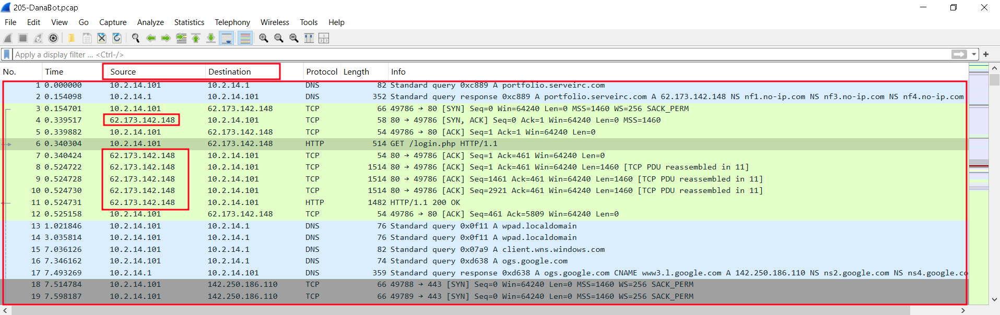

## What is the name of the malicious file used for initial access?
allegato_708.js

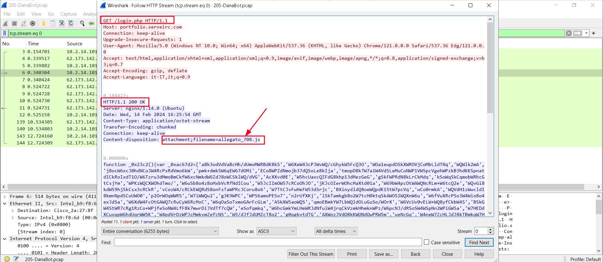


## What is the SHA-256 hash of the malicious file used for initial access?
847b4ad90b1daba2d9117a8e05776f3f902dda593fb1252289538acf476c4268

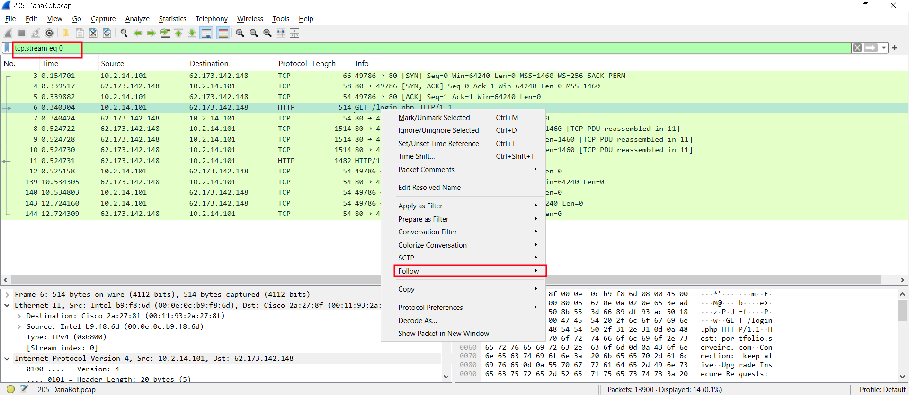

Copy dòng function đến hết và mở note dán nội dung vào và lưu thành file `allegato_708.js`

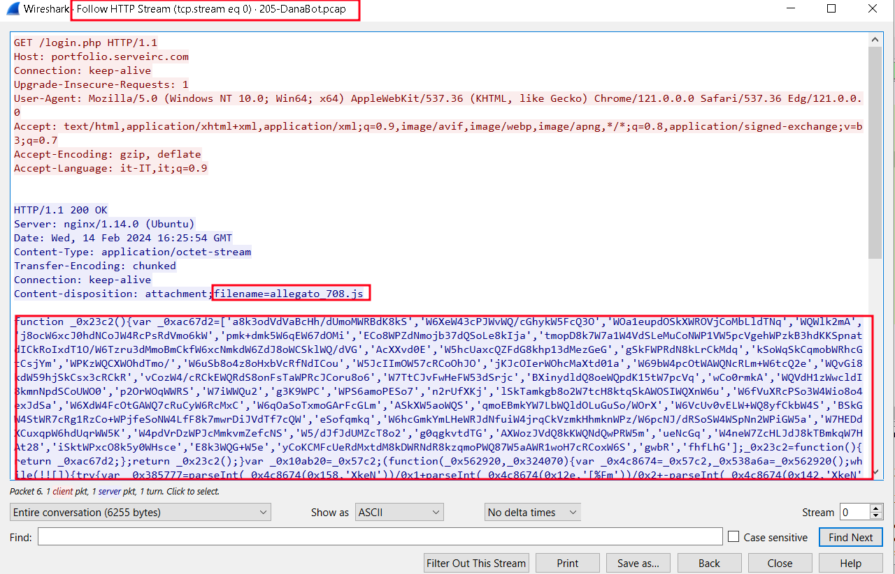

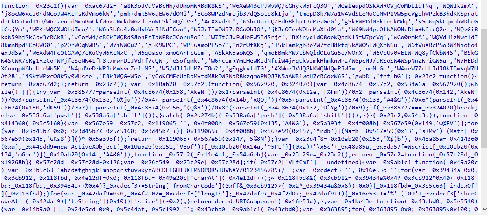

Cuối cùng kiểm tra mã hash dùng `certutil -hashfile allegato_708.js sha256`

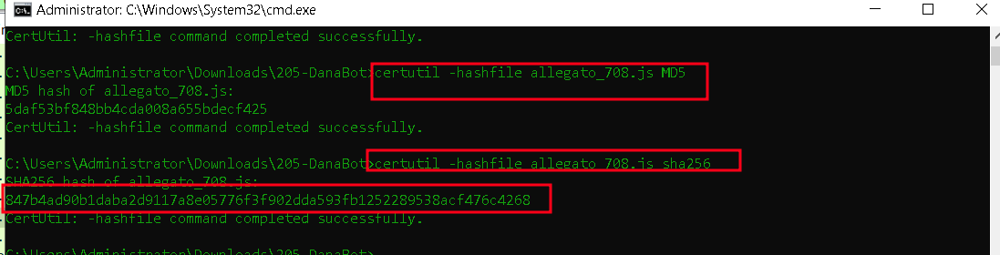

## Which process was used to execute the malicious file?
wscript.exe

Dựa vào link mã hash trên dùng any.run xem các kết quả đã báo cáo
```
Link: https://any.run/report/847b4ad90b1daba2d9117a8e05776f3f902dda593fb1252289538acf476c4268/a886894d-8ae4-4d59-a990-b59536885da8
```
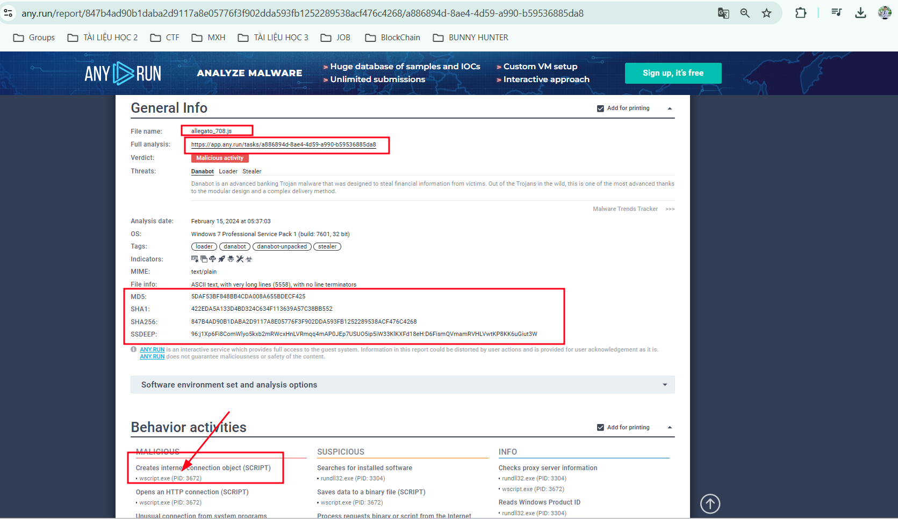

## What is the file extension of the second malicious file utilized by the attacker?
.dll 

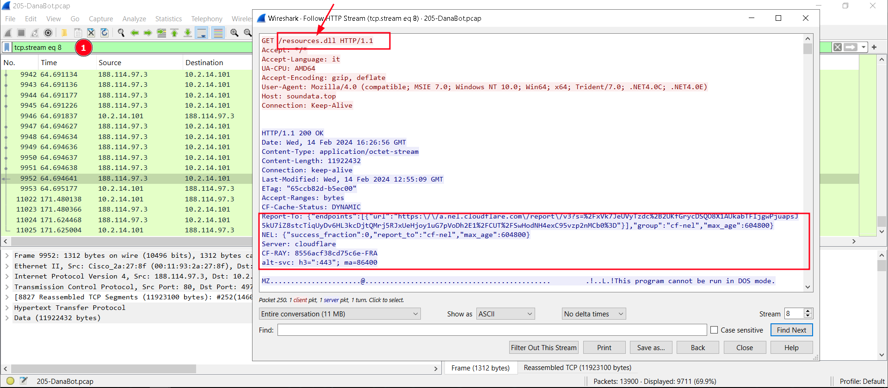

## What is the MD5 hash of the second malicious file?
e758e07113016aca55d9eda2b0ffeebe

Vào mục file xuất ra file http 

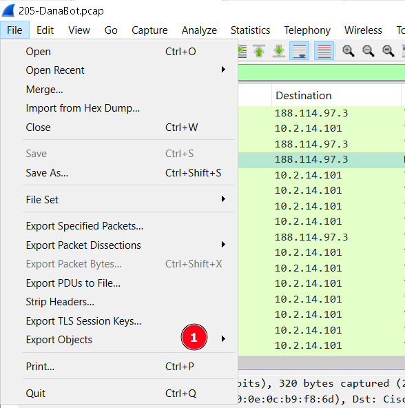

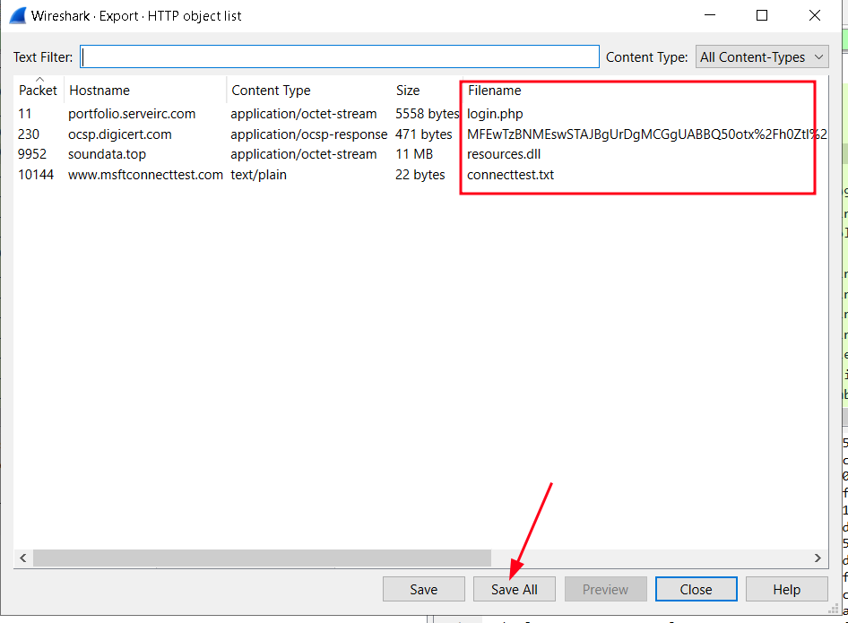

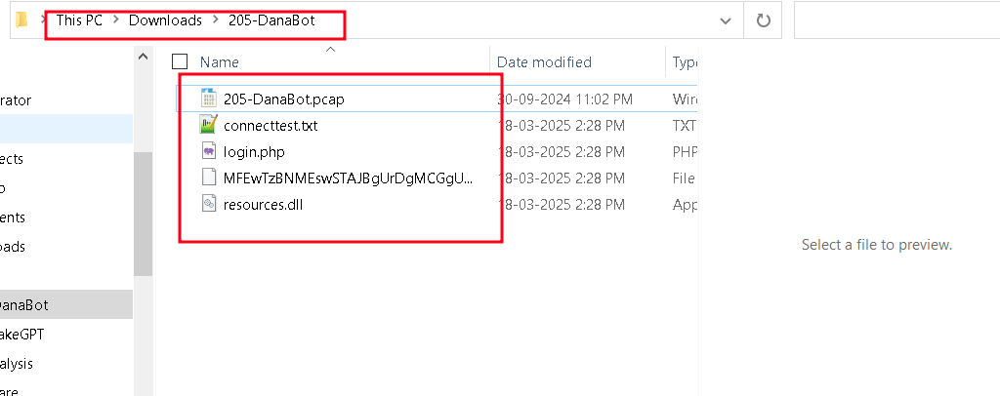

Cuối cùng kiểm tra mã hash với `certutil -hashfile resources.dll MD5`

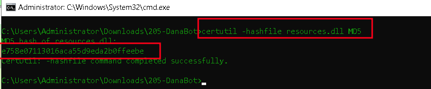