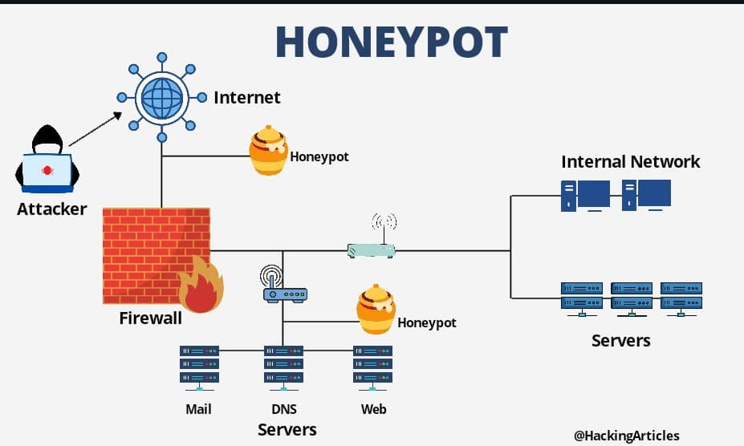

## Honeypot 
Honeypot trong hệ thống SOC: Hũ mật ngọt cho kẻ tấn công
Chủ đề tiếp theo chúng ta sẽ bàn về HoneyPot. Trong hệ thống SOC, bên cạnh SIEM để phân tích log và IDS/IPS để phát hiện/chặn tấn công, honeypot là một “vũ khí bí mật” khác – không phải để ngăn chặn mà để dụ kẻ thù lộ diện. 
Honeypot đóng vai trò như “mồi nhử” giúp SOC hiểu cách hacker hoạt động, từ đó cải thiện phòng thủ. Hôm nay, mình sẽ phân tích chi tiết về honeypot – từ cách nó hoạt động, vai trò trong các cấp độ SOC, đến cách triển khai thực chiến. Cùng khám phá nhé!
1. Honeypot là gì?
Định nghĩa: Honeypot là một hệ thống hoặc tài nguyên giả lập (như server, ứng dụng, file) được thiết kế để thu hút kẻ tấn công, ghi lại hành vi của chúng, và cung cấp thông tin cho SOC.
Mục tiêu:
Phát hiện tấn công sớm, đặc biệt là các mối đe dọa chưa biết (zero-day, APT).
Thu thập dữ liệu về kỹ thuật tấn công (TTPs – Tactics, Techniques, Procedures).
Làm chậm hoặc đánh lạc hướng hacker.
Ví dụ: Một server giả chạy SSH để dụ hacker brute force, ghi lại IP và mật khẩu họ dùng.
2. Honeypot hoạt động thế nào?
Honeypot là “mồi nhử” thông minh, hoạt động theo cơ chế:
Triển khai:
---Đặt trong mạng (DMZ, VLAN riêng) hoặc bên ngoài như “cái bẫy” độc lập.
---Cố ý để lộ điểm yếu (port mở, mật khẩu yếu) để hấp dẫn hacker.
Ghi nhận:
---Log mọi tương tác (đăng nhập, lệnh, file upload).
---Gửi dữ liệu về SOC qua SIEM hoặc hệ thống riêng.
Phân loại:
---Low-interaction: Giả lập cơ bản (như SSH), ít tài nguyên, ít rủi ro.
---High-interaction: Hệ thống thật (như Windows server), ghi chi tiết hơn, rủi ro cao hơn.
Ví dụ: Một honeypot SSH log “IP 203.0.113.5 thử 100 mật khẩu trong 5 phút” – dấu hiệu brute force.
3. Vai trò của Honeypot trong SOC
Honeypot bổ sung cho IDS/IPS và SIEM, đóng vai trò ở mọi cấp độ:
SOC Level 1: Giám sát ban đầu
Phát hiện tấn công cơ bản (quét port, brute force) mà IDS có thể bỏ sót.
Cung cấp alert sớm (như “IP lạ đăng nhập honeypot”).
Ví dụ: Level 1 thấy “203.0.113.5 quét port 22 trên honeypot”, escalate lên.
SOC Level 2: Phân tích sâu
Phân tích log honeypot để hiểu TTPs (như lệnh hacker chạy).
Xác định mẫu mã độc (file upload từ hacker).
Ví dụ: Level 2 thấy hacker upload “malware.exe” qua honeypot, chạy sandbox để phân tích.
SOC Level 3: Săn lùng và chiến lược
Dùng dữ liệu honeypot để hunt APT trong mạng thật.
Cập nhật Threat Intel (IP, domain C2 từ honeypot).
Ví dụ: Level 3 viết YARA rule từ sample honeypot, quét toàn mạng.
4. Các loại Honeypot phổ biến
Honeypot có nhiều dạng, tùy mục đích triển khai:
Theo mức độ tương tác:
Low-interaction: Giả lập dịch vụ (SSH, HTTP), dễ cài, ít rủi ro.
Ví dụ: Cowrie (SSH honeypot).
High-interaction: Hệ thống thật (Windows/Linux), chi tiết hơn, rủi ro bị khai thác.
Ví dụ: Máy ảo Windows với RDP mở.
Theo mục đích:
Server Honeypot: Dụ tấn công dịch vụ (webserver, database).
Ví dụ: Kippo (SSH).
Client Honeypot: Phát hiện tấn công từ website độc (drive-by download).
Ví dụ: HoneyClient.
Honeytoken: File giả (như “passwords.txt”) để phát hiện truy cập trái phép.
Ví dụ: File PDF báo động khi mở.
Công cụ phổ biến:
Cowrie: SSH/Telnet honeypot, ghi lại brute force.
Dionaea: Dụ malware qua SMB, HTTP.
HoneyPy: Dễ tùy chỉnh, đa dịch vụ.
T-Pot: Kết hợp nhiều honeypot (Cowrie, Dionaea) trong một.
5. Ứng dụng thực chiến trong SOC
Honeypot là “tai mắt” của SOC, đây là cách dùng:
a. Phát hiện tấn công cơ bản
Mục tiêu: Nhận diện quét mạng, brute force.
Triển khai: Cài Cowrie giả SSH trên port 22.
Kết quả: Log “IP 203.0.113.5 thử ‘admin:1234’” – báo Level 1.
b. Thu thập thông tin APT
Mục tiêu: Ghi lại TTPs của APT.
Triển khai: Máy ảo Windows với RDP mở (high-interaction).
Kết quả: Hacker upload backdoor, chạy PowerShell – Level 2 phân tích sample, Level 3 hunt mạng thật.
c. Phát hiện Zero-Day
Mục tiêu: Tìm khai thác chưa biết.
Triển khai: Dionaea giả SMB (port 445).
Kết quả: Hacker gửi exploit lạ, SOC gửi vendor (Microsoft) để vá.
6. Ví dụ thực chiến
Tình huống: SOC nghi ngờ APT nhắm vào mạng tài chính.
Triển khai:
Honeypot: Cài Cowrie (SSH) và HoneyPy (HTTP) trong DMZ.
Kết quả:
Cowrie log: “203.0.113.5 thử 50 mật khẩu, chạy whoami”.
HoneyPy log: “GET /admin.php từ cùng IP”.
Phân tích:
Level 1: Báo “IP lạ tấn công honeypot”.
Level 2: Xác nhận brute force + thăm dò web, tra Threat Intel (IP thuộc APT29).
Level 3: Viết YARA từ lệnh “whoami”, quét mạng thật.
Kết luận: Phát hiện APT sớm, chặn IP trước khi lây lan.
7. Ưu và nhược điểm
Ưu điểm:
Phát hiện sớm: Bắt tấn công mà IDS/IPS bỏ sót.
Thu thập dữ liệu: Hiểu TTPs, cải thiện Threat Intel.
Ít false positive: Chỉ có hacker mới tương tác với honeypot.
Nhược điểm:
Không ngăn chặn: Chỉ dụ và ghi, cần kết hợp IPS.
Rủi ro: High-interaction có thể bị khai thác ngược.
Tài nguyên: Triển khai và quản lý tốn công sức.
8. Lời khuyên thực chiến
Đặt khéo léo: Trong DMZ hoặc VLAN riêng, tránh ảnh hưởng mạng thật.
Giả lập chân thật: Dùng tên server/file hấp dẫn (như “finance-db”, “passwords.txt”).
Kết hợp SIEM: Gửi log honeypot vào SIEM để phân tích tập trung.
Lab thử: Cài Cowrie trên máy ảo, quét bằng Nmap để test.
Cập nhật thường xuyên: Thay đổi port/dịch vụ để tránh hacker nhận ra.
9. Ví dụ triển khai
Cowrie rule (config):
[ssh]
port = 2222
version = OpenSSH_7.9
​
Kết quả log:
2025-03-02 10:00:00 [SSH] Login attempt: user=root pass=admin123 from 203.0.113.5
​
Hành động: SOC chặn IP, phân tích mật khẩu thử nghiệm.
Câu hỏi để bạn thử:
Bạn sẽ thiết kế honeypot thế nào để dụ ransomware?

