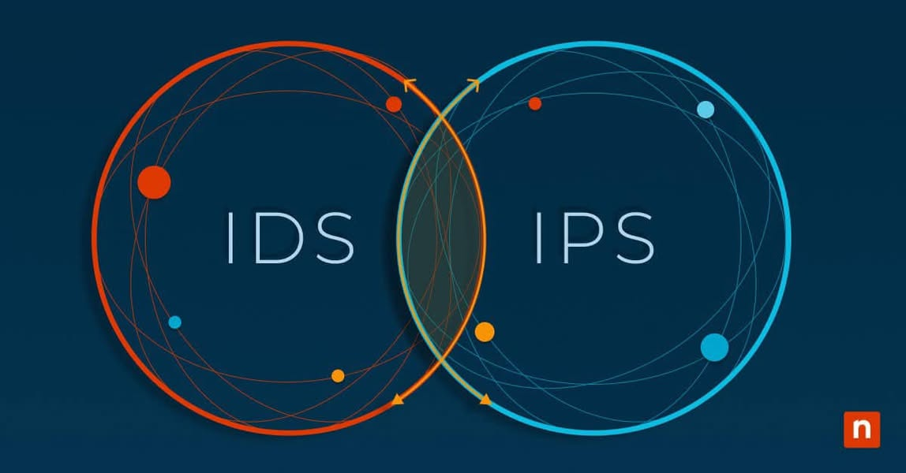

## IDS/IPS trong hệ thống SOC
IDS/IPS trong hệ thống SOC: Lá chắn và mắt thần của bảo mật
Chào anh em! Sau khi tìm hiểu về SIEM – “bộ não” gom dữ liệu và phân tích trong SOC, giờ chúng ta đến với IDS/IPS – “lá chắn” và “mắt thần” giúp phát hiện và ngăn chặn mối đe dọa ngay tại mạng. Trong hệ thống SOC, IDS/IPS đóng vai trò không thể thiếu, từ giám sát lưu lượng đến phản ứng tức thời. Hôm nay, mình sẽ phân tích chi tiết về IDS/IPS, từ cách hoạt động, vai trò trong các cấp độ SOC, đến cách dùng thực chiến. Cùng khám phá nhé!
1. IDS và IPS là gì?
IDS (Intrusion Detection System): Hệ thống phát hiện xâm nhập, giám sát lưu lượng mạng để tìm dấu hiệu tấn công (như malware, quét port), sau đó cảnh báo SOC. 
Ví dụ: Phát hiện IP lạ quét port 445 (SMB).
IPS (Intrusion Prevention System): Hệ thống ngăn chặn xâm nhập, mở rộng từ IDS bằng cách không chỉ phát hiện mà còn chặn lưu lượng độc hại ngay lập tức. 
Ví dụ: Chặn IP quét port 445 trước khi nó khai thác lỗ hổng.
Khác biệt chính: 
IDS: Thụ động (passive) – chỉ báo động.
IPS: Chủ động (active) – báo động + ngăn chặn.
2. IDS/IPS hoạt động thế nào?
IDS/IPS là “người gác cổng” của mạng, hoạt động dựa trên các cơ chế sau:
Phương pháp phát hiện: 
Signature-based: So sánh lưu lượng với cơ sở dữ liệu mẫu (signature) của tấn công đã biết. 
Ví dụ: Nhận diện WannaCry qua mẫu EternalBlue.
Anomaly-based: Phát hiện bất thường so với hành vi bình thường (baseline). 
Ví dụ: Spike lưu lượng đến port lạ.
Heuristic-based: Dùng quy tắc thông minh để nhận diện tấn công chưa biết (giống zero-day).
Vị trí triển khai: 
Network-based (NIDS/NIPS): Đặt trên mạng (gần firewall, switch) để giám sát toàn bộ lưu lượng.
Host-based (HIDS/HIPS): Cài trên máy chủ/endpoint để theo dõi hoạt động cục bộ.
Quy trình: 
Thu thập lưu lượng (hoặc log hệ thống).
Phân tích theo rule/signature.
IDS báo alert qua SIEM, IPS chặn trực tiếp (drop packet).
3. Vai trò của IDS/IPS trong SOC
IDS/IPS là “cánh tay phải” của SOC, hỗ trợ ở mọi cấp độ:
- SOC Level 1: Giám sát ban đầu 
---IDS cung cấp alert cho analyst (như “Port scan detected”).
---IPS chặn tấn công cơ bản (như DDoS, SQL injection).
Ví dụ: Snort IDS báo “IP 203.0.113.5 quét port 22”, Level 1 kiểm tra và escalate.
- SOC Level 2: Phân tích sâu 
---Dùng alert IDS để điều tra (tái hiện qua PCAP).
---Tinh chỉnh rule IPS để chặn chính xác hơn, giảm false positive.
Ví dụ: Level 2 xác nhận quét port là bước tiền APT, cập nhật IPS chặn IP đó.
-SOC Level 3: Săn lùng và chiến lược 
---Viết rule IDS/IPS tùy chỉnh để phát hiện APT/zero-day.
---Tích hợp Threat Intel để nâng cấp signature.
Ví dụ: Level 3 thêm rule phát hiện C2 của APT29 vào Suricata IPS.
4. Các công cụ IDS/IPS phổ biến
Mã nguồn mở: 
Snort: NIDS mạnh, dùng signature-based, dễ tùy chỉnh rule. 
Ví dụ: Rule alert tcp any any -> any 445 (msg:"SMB exploit"; sid:1000001;).
Suricata: NIDS/NIPS hiện đại, hỗ trợ multi-threading, anomaly detection. 
Ưu điểm: Nhanh, tích hợp Threat Intel (ET Open rules).
Zeek (Bro): NIDS phân tích hành vi, tạo log chi tiết hơn là alert.
Ví dụ: Ghi lại mọi HTTP request để hunt sau.
Thương mại: 
Cisco Secure IDS/IPS: Tích hợp với firewall Cisco, mạnh trong doanh nghiệp lớn.
Palo Alto Networks IPS: Dùng AI và signature, chặn zero-day tốt.
FortiGate IPS: Kết hợp firewall và IPS, dễ triển khai.
Host-based: 
OSSEC: HIDS miễn phí, phát hiện thay đổi file, rootkit.
CrowdStrike Falcon: HIDS/HIPS tích hợp EDR, chặn hành vi độc hại.
5. Ứng dụng thực chiến trong SOC
IDS/IPS là “mắt” và “tay” trong SOC, đây là cách dùng:
a. Phát hiện tấn công cơ bản
Mục tiêu: Nhận diện quét port, DDoS.
Rule Snort: snortalert tcp any any -> $HOME_NET 445 (msg:"SMB scan detected"; sid:1000002;)
Kết quả: IDS báo “SMB scan từ 203.0.113.5”, IPS chặn ngay.
b. Phát hiện APT/Zero-Day
Mục tiêu: Tìm C2 hoặc hành vi bất thường.
Rule Suricata: suricataalert http $HOME_NET any -> $EXTERNAL_NET any (msg:"Suspicious HTTPS to new domain"; flow:established,to_server; http.host; content:"*.ru"; http.method; content:"POST"; sid:2000001;)
Kết quả: Phát hiện HTTPS POST đến domain .ru mới, nghi C2 APT.
c. Bảo vệ ICS
Mục tiêu: Phát hiện tấn công PLC (như Triton).
Rule Zeek: zeekevent modbus_message(c: connection, headers: ModbusHeaders) { if (headers.function_code == 0x06) print "Suspicious Modbus write";
}
Kết quả: Ghi log lệnh ghi PLC bất thường, báo SOC.
6. Ví dụ thực chiến
Tình huống: SOC nghi ngờ ransomware qua mạng.
Triển khai: 
IDS (Snort): Chạy rule phát hiện EternalBlue: snortalert tcp any any -> $HOME_NET 445 (msg:"EternalBlue attempt"; content:"|FF|SMB"; sid:1000003;)
IPS (Suricata): Chặn IP tấn công: suricatadrop tcp any any -> $HOME_NET 445 (msg:"Block EternalBlue"; content:"|FF|SMB"; sid:2000002;)
Kết quả: IDS báo “203.0.113.5 gửi SMB exploit”, IPS chặn, Level 2 phân tích PCAP.
Kết luận: Ngăn ransomware WannaCry trước khi lây lan.
7. Ưu và nhược điểm
Ưu điểm: 
IDS: Phát hiện nhanh, cung cấp dữ liệu cho SIEM.
IPS: Ngăn chặn tức thời, giảm thiệt hại.
Linh hoạt: Rule tùy chỉnh được.
Nhược điểm: 
IDS: Chỉ báo, không chặn – cần analyst xử lý.
IPS: Có thể chặn nhầm (false positive), gây gián đoạn.
Hạn chế với zero-day: Signature-based yếu với tấn công mới.
8. Lời khuyên thực chiến
Triển khai đúng chỗ: IDS ở điểm vào/ra mạng, IPS gần endpoint nhạy cảm.
Tinh chỉnh rule: Giảm false positive bằng cách thêm điều kiện (port, IP whitelist).
Kết hợp SIEM: Đưa alert IDS vào SIEM để phân tích sâu.
Lab thử: Cài Snort/Suricata trên máy ảo, quét port bằng Nmap để test.
Cập nhật Threat Intel: Tải rule từ Emerging Threats cho Suricata.

