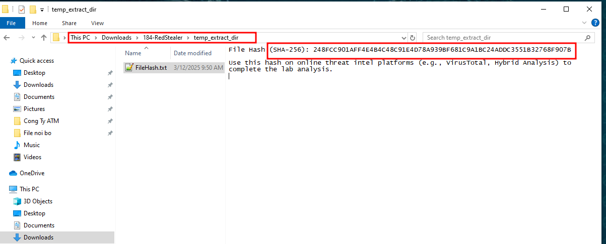
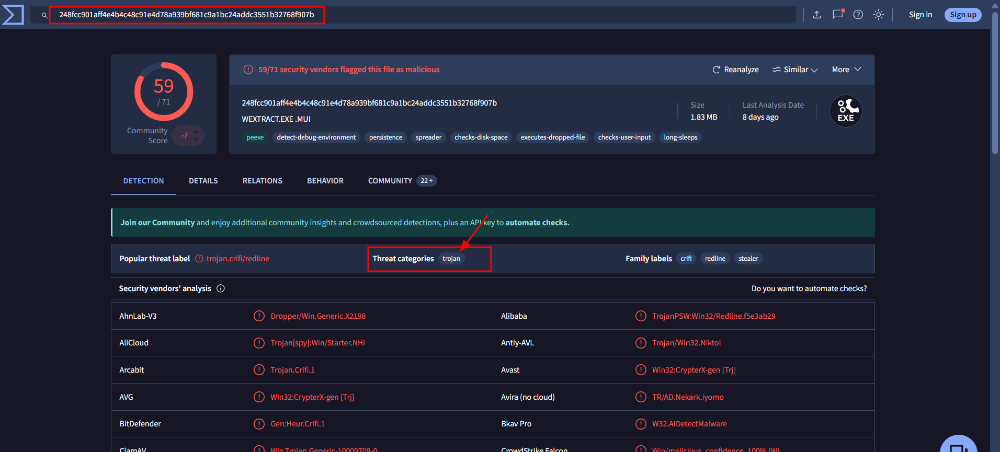
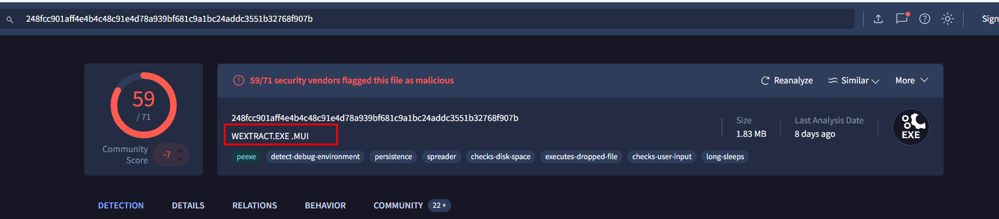
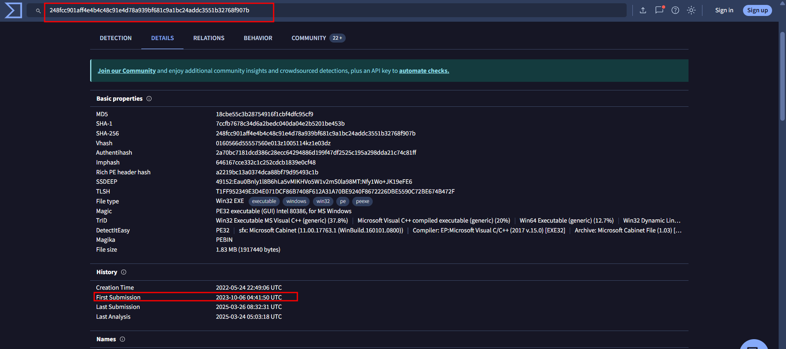
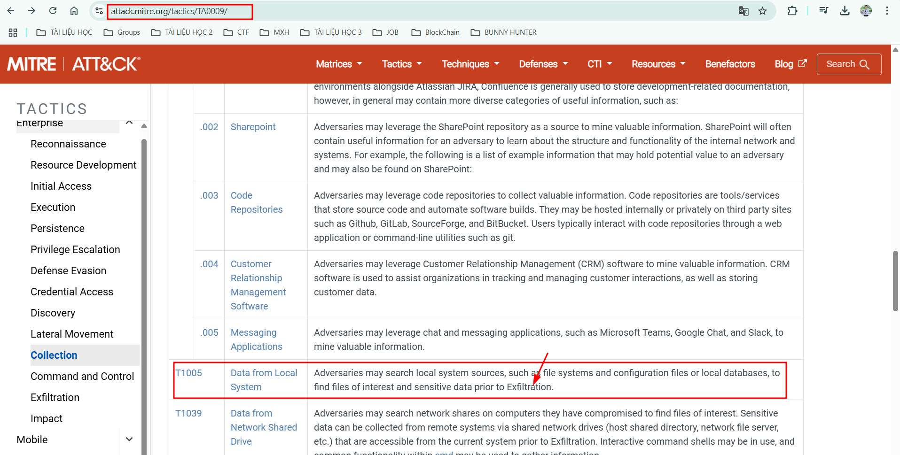
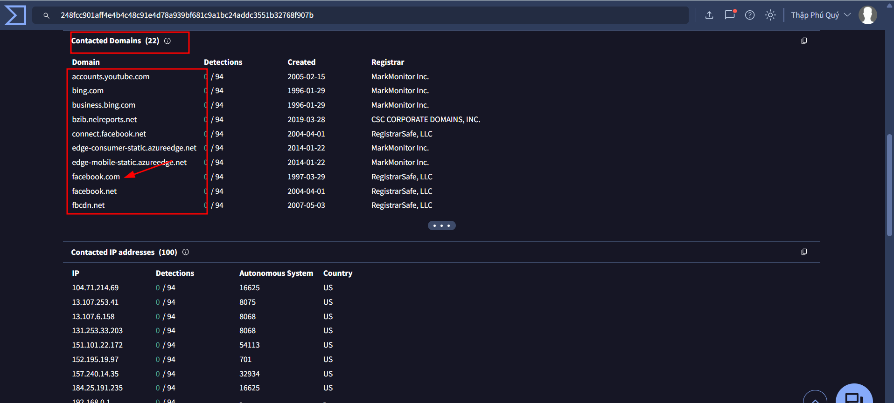
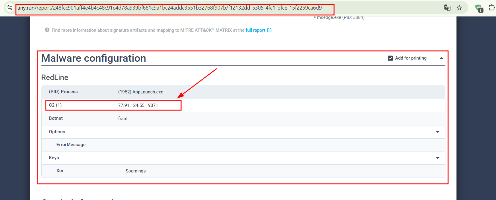
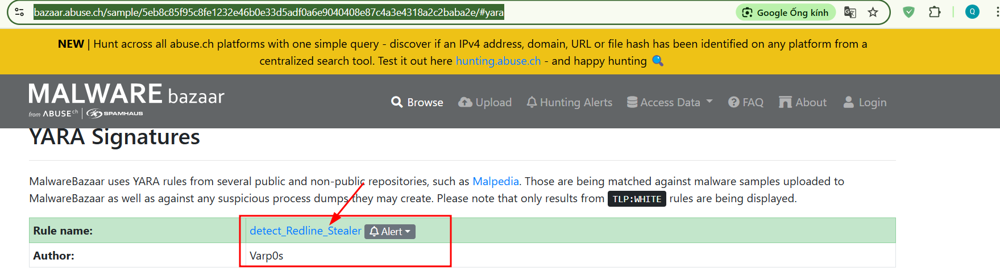
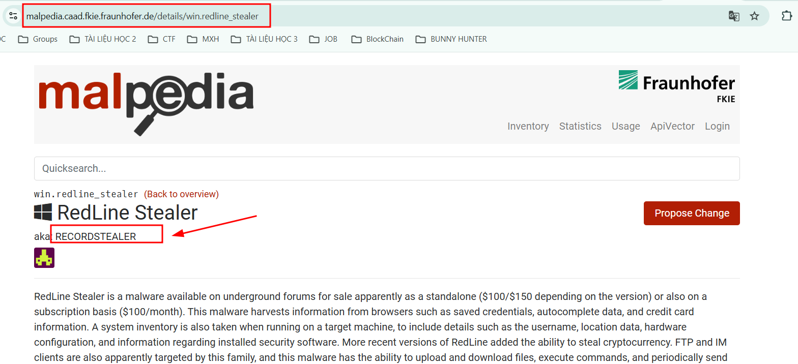
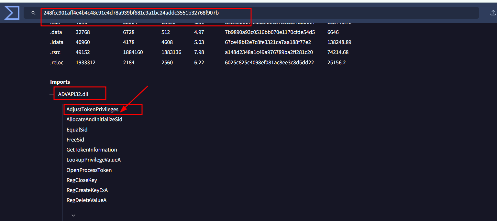

## Categorizing malware enables a quicker and clearer understanding of its unique behaviors and attack vectors. What category has Microsoft identified for that malware in VirusTotal?
`trojan`

Sau khi tải file về ta có mã hash như sau:

Dùng virustotal phân tích mã Hash (SHA-256): `248FCC901AFF4E4B4C48C91E4D78A939BF681C9A1BC24ADDC3551B32768F907B` ta được báo ==> `trojan`

## Clearly identifying the name of the malware file improves communication among the SOC team. What is the file name associated with this malware?
##### Note: Don't include the file extension in the name.
`WEXTRACT`

Dựa vào kết quả trên ta có được cái tên là `WEXTRACT.EXE.MUI`

## Knowing the exact timestamp of when the malware was first observed can help prioritize response actions. Newly detected malware may require urgent containment and eradication compared to older, well-documented threats. What is the UTC timestamp of the malware's first submission to VirusTotal?
`2023-10-06 04:41`

Dựa vào kết quả ta được thời gian đầu tiên tệp này `2023-10-06 04:41:50 UTC`

## Understanding the techniques used by malware helps in strategic security planning. What is the MITRE ATT&CK technique ID for the malware's data collection from the system before exfiltration?
`T1005`

Dựa vào attack mitre ck ta được như sau chú ý từ câu hỏi và kết quả tìm kiếm là `Exfiltration`

## Following execution, which social media-related domain names did the malware resolve via DNS queries?
`facebook.com`

Vào tab Relations ta có các dns như sau vì câu hỏi đến dns đến social media nên ==> `facebook.com`

## Once the malicious IP addresses are identified, network security devices such as firewalls can be configured to block traffic to and from these addresses. Can you provide the IP address and destination port the malware communicates with?
`77.91.124.55:19071`

Dựa vào báo cáo any.run ta được như sau [Link báo cáo](https://any.run/report/248fcc901aff4e4b4c48c91e4d78a939bf681c9a1bc24addc3551b32768f907b/f12132dd-5305-4fc1-bfce-15f2259ca6d9)

## YARA rules are designed to identify specific malware patterns and behaviors. Using MalwareBazaar, what's the name of the YARA rule created by "Varp0s" that detects the identified malware?
`detect_Redline_Stealer`

Sau khi tìm kiếm trên MalwareBazaar ta được thông tin sau Link MalwareBazaar [Link báo cáo](https://bazaar.abuse.ch/sample/5eb8c85f95c8fe1232e46b0e33d5adf0a6e9040408e87c4a3e4318a2c2baba2e/#yara)

## Understanding which malware families are targeting the organization helps in strategic security planning for the future and prioritizing resources based on the threat. Can you provide the different malware alias associated with the malicious IP address according to ThreatFox?
`RECORDSTEALER`

Dùng Malpedia cung cấp thông tin toàn diện và được quản lý về các họ phần mềm độc hại [Link báo cáo](https://malpedia.caad.fkie.fraunhofer.de/details/win.redline_stealer)

## By identifying the malware's imported DLLs, we can configure security tools to monitor for the loading or unusual usage of these specific DLLs. Can you provide the DLL utilized by the malware for privilege escalation?
`ADVAPI32.dll`

Từ báo cáo trên ta nhận được như sau

