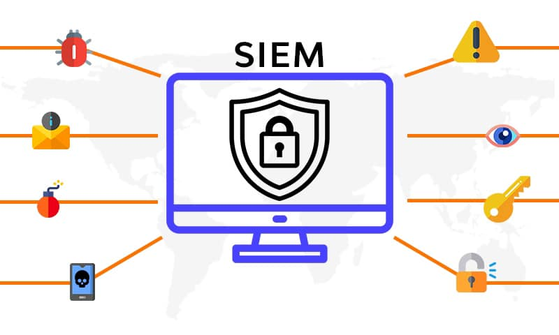

## SIEM
Chào cả nhà! Hôm nay mình muốn nói về SIEM - “trái tim” của SOC từ 2.0 trở lên. Nếu SOC 1.0 là “cày tay” thì SIEM chính là bước ngoặt giúp tự động hóa, phân tích thông minh. Dưới đây mình sẽ giải thích vai trò của nó, liệt kê vài công cụ mã nguồn mở, và phân tích ưu nhược điểm để mọi người dễ hình dung.
Vai trò của SIEM trong SOC
SIEM là viết tắt của Security Information and Event Management, vừa thu thập thông tin (log, sự kiện) vừa quản lý, phân tích để bảo vệ hệ thống. Nó như một “trợ thủ đắc lực” của đội SOC với các vai trò chính:
 1. Tập trung dữ liệu: Gom log từ firewall, server, IDS, endpoint… về một chỗ, thay vì analyst phải chạy vòng quanh kiểm tra từng máy.
 2. Phát hiện mối đe dọa: Tự động phân tích log, phát hiện bất thường (như brute force, malware) dựa trên rule hoặc pattern.
 3. Cảnh báo(real-time): Báo động ngay khi có vấn đề, giúp đội SOC phản ứng kịp thời.
 4. Hỗ trợ điều tra: Lưu trữ log dài hạn, cung cấp công cụ tìm kiếm để “đào” sâu nguyên nhân sự cố.
 5. Báo cáo: Tạo report chuyên nghiệp cho sếp hoặc audit, đỡ tốn công viết tay.
Nói đơn giản, SIEM là “mắt thần” giúp SOC nhìn rõ mọi thứ, từ đó tiết kiệm thời gian và nâng cao hiệu quả.
Các công cụ SIEM mã nguồn mở phổ biến
Mua SIEM thương mại như Splunk, QRadar thì ngon nhưng đắt, nên mình gợi ý vài công cụ miễn phí đáng thử:
 1. Elastic Stack (ELK)
 • Mô tả: Gồm Elasticsearch (lưu trữ), Logstash (xử lý log), Kibana (trực quan hóa). Dùng tốt cho SOC 2.0 nhỏ.
 • Cách dùng: Cài trên Linux, cấu hình Logstash nhận log từ Syslog, xem dashboard qua Kibana.
 2. Graylog
 • Mô tả: SIEM mã nguồn mở với giao diện thân thiện, hỗ trợ xử lý log và cảnh báo.
 • Cách dùng: Cài trên server, tích hợp nguồn log qua GELF hoặc Syslog, tạo rule trong mục Alerts.
 3. Wazuh
 • Mô tả: Kết hợp SIEM và HIDS (Host Intrusion Detection), mạnh về giám sát endpoint và phát hiện mã độc.
 • Cách dùng: Cài Wazuh Manager + agent trên máy trạm, tích hợp với ELK để trực quan hóa.
 4. OSSEC
 • Mô tả: Ban đầu là HIDS, nhưng khi kết hợp với công cụ khác (như ELK), thành SIEM cơ bản.
 • Cách dùng: Cài agent trên máy cần giám sát, gửi log về server trung tâm để phân tích.
Ưu và nhược điểm của các công cụ SIEM mã nguồn mở
1. Elastic Stack (ELK)
 • Ưu điểm:
 • Miễn phí, linh hoạt, cộng đồng hỗ trợ mạnh.
 • Tùy chỉnh dễ, tích hợp được nhiều nguồn dữ liệu (firewall, IDS, Windows…).
 • Kibana đẹp, trực quan, dễ tạo dashboard.
 • Nhược điểm:
 • Cài đặt và cấu hình phức tạp, cần biết cơ bản về Linux.
 • Tiêu tốn tài nguyên (RAM, CPU) nếu xử lý log lớn.
 • Không có tính năng “out-of-the-box” mạnh như SIEM trả phí.
2. Graylog
 • Ưu điểm:
 • Giao diện thân thiện, dễ dùng hơn ELK với người mới.
 • Hỗ trợ cảnh báo qua email, Slack ngay từ đầu.
 • Tích hợp tốt với các hệ thống doanh nghiệp nhỏ.
 • Nhược điểm:
 • Tính năng nâng cao (như phân tích hành vi) yếu hơn ELK.
 • Hiệu suất giảm nếu log quá nhiều mà không tối ưu server.
 • Cộng đồng nhỏ hơn, tài liệu không phong phú bằng.
3. Wazuh
 • Ưu điểm:
 • Miễn phí, mạnh về giám sát endpoint và phát hiện mã độc.
 • Tích hợp sẵn HIDS, phù hợp cho SOC cần bảo vệ máy trạm.
 • Có dashboard đẹp khi kết hợp với Kibana.
 • Nhược điểm:
 • Tập trung vào endpoint hơn là mạng tổng thể.
 • Cần thêm công cụ (như ELK) để thành SIEM hoàn chỉnh.
 • Quản lý agent trên nhiều máy có thể phức tạp.
4. OSSEC
 • Ưu điểm:
 • Nhẹ, dễ cài, ít tốn tài nguyên.
 • Phát hiện xâm nhập trên host cực tốt (như thay đổi file, rootkit).
 • Miễn phí, cộng đồng lâu đời.
 • Nhược điểm:
 • Không phải SIEM đầy đủ, cần kết hợp tool khác (như ELK) để phân tích.
 • Giao diện cơ bản, không trực quan.
 • Hạn chế với mạng lớn hoặc dữ liệu phức tạp.
Kinh nghiệm thực tế
 • Nếu mới bắt đầu, thử ELK vì linh hoạt và phổ biến nhất. Mình từng dùng nó cho một công ty nhỏ, gom log từ 10 server và 50 máy trạm, chạy ổn trong 6 tháng đầu.
 • Muốn nhanh gọn, chọn Graylog – ít phải cấu hình lằng nhằng.
 • Nếu lo endpoint bị tấn công (như ransomware), Wazuh là lựa chọn đáng cân nhắc.
 • Còn OSSEC thì hợp với hệ thống siêu nhỏ, ít nhân sự.

 