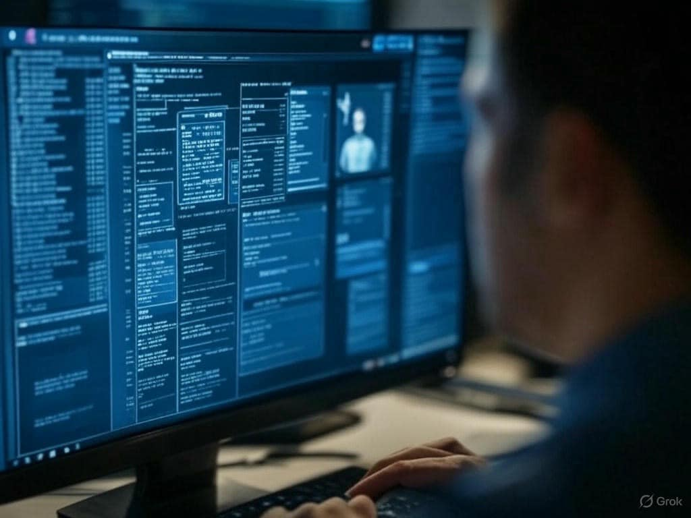

## Bài viết này sẽ nêu ứng dụng thực tế của các khung an ninh trong SOC. Hãy tưởng tượng SOC như một "pháo đài chống hacker" và các khung này là "vũ khí bí mật" nhé!

Bài viết này sẽ nêu ứng dụng thực tế của các khung an ninh trong SOC. Hãy tưởng tượng SOC như một "pháo đài chống hacker" và các khung này là "vũ khí bí mật" nhé!
---
1. MITRE ATT&CK: Bản đồ kho báu của hacker
Nó là gì?: Đây như cuốn "sách giáo khoa" mà hacker không bao giờ muốn bạn đọc. MITRE ATT&CK liệt kê mọi chiêu trò chúng dùng: từ dụ bạn click email "Bạn trúng 1 tỷ!" (Phishing) đến lén lút cài mã độc khi bạn đang mải xem phim (Exploitation).
Ứng dụng thực tế:
Ví dụ: SOC phát hiện thằng cha hacker dùng "Spearphishing Attachment" (T1566.001) gửi file "Hình hot girl.rar". Nhờ MITRE, đội SOC biết ngay chiêu này, bật chế độ "mắt thần" quét email, chặn đứng cái file trước khi anh nhân viên ngây thơ kịp unzip mà "toang" cả hệ thống.
Lợi ích: Giúp SOC không mò kim đáy bể, mà có hẳn "bản đồ" để đoán xem hacker đang ở bước nào: "À, nó vừa leo tường (Initial Access), giờ chắc đang lục két sắt (Credential Dumping) rồi!"
Tình huống: "Sếp hỏi: 'Hacker làm gì hôm nay?' SOC trả lời: 'Dạ, theo MITRE, nó đang ở mục T1083 - mò file nhạy cảm, chắc tìm ảnh sếp đi karaoke!'"
2. NIST CSF: "Sổ tay sống sót" của SOC
Nó là gì?: NIST giống như "bà mẹ nghiêm khắc" dặn dò từng bước: Xác định (Identify) cái gì quan trọng, Bảo vệ (Protect) nó, Phát hiện (Detect) nếu có trộm, Ứng phó (Respond) khi bị tấn công, và Khôi phục (Recover) khi mọi thứ tan tành.
Ứng dụng thực tế:
Ví dụ: Công ty bị tấn công, SOC dùng NIST để "điểm danh" tài sản: "Máy chủ chứa dữ liệu lương - quan trọng, máy in cũ góc phòng - kệ nó!" Sau đó bật IDS (Detect) thấy lưu lượng lạ, chạy đi khóa cửa (Protect), rồi ngồi họp "đổ lỗi" (Respond) trước khi khôi phục lại hệ thống và đổ thêm cà phê (Recover).
Lợi ích: Giúp SOC không bị rối như gà mắc tóc khi sự cố xảy ra, mà có hẳn checklist: "Ừ, làm xong bước 3 rồi, giờ tới bước 4!"
Tình huống: "Hacker tấn công, cả đội SOC hoảng loạn. Nhờ NIST, trưởng nhóm hét: 'Bình tĩnh, mở Identify ra xem cái server nào đáng cứu trước đã!'"
3. Cyber Kill Chain: "Phim hành động 7 tập" của hacker
Nó là gì?: Mô hình này chia cuộc tấn công thành 7 hồi như phim bom tấn: từ hacker ngồi "stalk" bạn (Reconnaissance) đến lúc nó "ôm tiền chạy trốn" (Actions on Objectives).
Ứng dụng thực tế:
Ví dụ: SOC thấy lưu lượng lạ từ IP nước ngoài, kiểm tra Kill Chain: "Ồ, nó vừa gửi email lừa (Delivery), giờ đang khai thác lỗ hổng phần mềm (Exploitation)." Đội bật firewall chặn liên lạc C2 (Command and Control), hacker ngồi khóc vì "phim bị cắt giữa chừng".
Lợi ích: Giúp SOC "bắt bài" hacker ở từng cảnh, không để nó diễn hết tập 7.
Tình huống: "Hacker mới tới đoạn Installation, SOC hét lên: 'Cắt! Không có cảnh sau đâu mà mơ!'"
4. CIS Controls: "Bí kíp đơn giản cho người lười"
Nó là gì?: CIS giống như "18 cách sống sót" cho SOC, kiểu: "Kiểm kê đồ đạc đi (Control 1), khóa cửa kỹ vào (Control 4), đừng để log đầy bụi (Control 6)".
Ứng dụng thực tế:
Ví dụ: Công ty nhỏ, SOC chỉ có 3 người. Nhờ CIS, họ đặt rule đơn giản: "Máy nào không ai dùng thì tắt (Control 2), log lạ là báo ngay (Control 6)." Kết quả: Hacker vừa chạm mạng đã bị tóm vì "đụng nhầm ổ khóa cơ bản".
Lợi ích: Dễ làm, không cần "cao siêu", phù hợp cả đội ngũ "ngáp hoài" vẫn hiểu.
Tình huống: "Hacker cười khẩy: 'Mạng này yếu thế!' Ai ngờ CIS Control 4 bật cập nhật phần mềm, nó khai thác hụt, ngã ngửa!"
5. ISO/IEC 27001: "Giấy chứng nhận SOC ngon lành"
Nó là gì?: ISO giống như "bằng khen" để khoe với khách hàng: "Chúng tôi an toàn, có kiểm soát đàng hoàng!" Nó yêu cầu bạn xây quy trình từ A-Z, từ quản lý rủi ro đến giám sát.
Ứng dụng thực tế:
Ví dụ: SOC áp dụng A.12.4 (Monitoring), đặt cảnh báo khắp hệ thống. Hacker vừa đăng nhập lạ, chuông kêu inh ỏi, cả đội chạy tới như "biệt đội siêu anh hùng" khóa tài khoản ngay.
Lợi ích: Không chỉ an toàn mà còn "đẹp mặt" với đối tác, kiểu: "Nhìn đi, tụi tui có ISO đây nha!"
Tình huống: "Khách hàng hỏi: 'An toàn không?' SOC vỗ ngực: 'ISO 27001 đây, hacker có giỏi thì vào thử!'"
Kết hợp "vũ khí" trong SOC
Ví dụ thực tế: Hacker tấn công công ty game. SOC dùng MITRE ATT&CK để biết nó đang "Credential Dumping" (T1003), Cyber Kill Chain xác định nó mới ở "Installation", NIST bảo "Respond" bằng cách khóa server, CIS nhắc "Check log đi!", còn ISO thì ghi lại hết để báo cáo sếp. 
Kết quả: Hacker out game, SOC thắng đậm!
Bài viết pha tính hài hước nhưng đầy đủ từ khóa để anh em tìm hiểu và nghiên cứu. Xong bài này cũng hết các định nghĩa, khái niệm trong SOC rồi, loạt bài sau sẽ đi qua một số case cụ thể, hoặc quy trình trong SOC. Anh em ủng hộ thì nhớ like và fl mình nhé!

