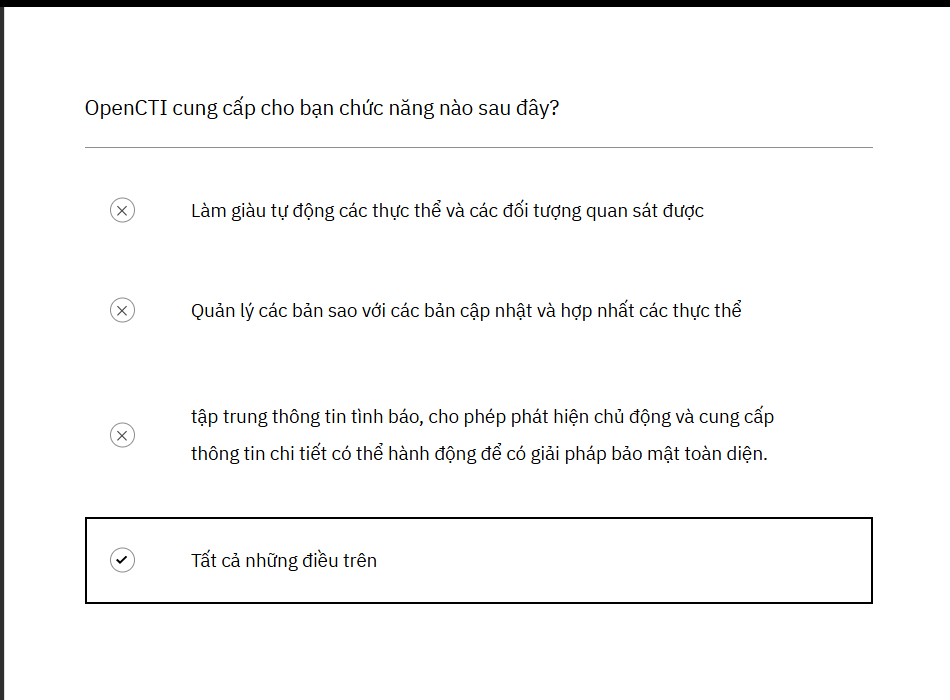

# Fundamentals of Threat Intelligence with OpenCTI - Cơ bản về trí thông minh đe dọa với OpenCTI
## 1. Giới thiệu về OpenCti và vòng đời tình báo đe dọa - Introduction to OpenCTI and the Threat Intelligence Lifecycle 
### OpenCTI là gì?

OpenCTI là một nền tảng toàn diện được thiết kế để giúp tập trung hóa, lưu trữ, quản lý và phân tích thông tin tình báo về mối đe dọa mạng (CTI) một cách hiệu quả.

Nhiều tổ chức đang phải vật lộn để quản lý dữ liệu về mối đe dọa mạng một cách hiệu quả. OpenCTI giải quyết vấn đề này bằng cách tập trung thông tin từ nhiều công cụ và nguồn khác nhau, tích hợp với các công cụ và môi trường hiện có của bạn, cải thiện khả năng hiển thị và hiệu quả.

`Mục tiêu chính:`

Thách thức chính là giám sát và tổng hợp hiệu quả tất cả thông tin về mối đe dọa có liên quan để đưa ra quyết định sáng suốt. OpenCTI quản lý một khối lượng lớn dữ liệu có thể hành động được, được đánh giá và xem xét hàng ngày.

`Mục tiêu chính là phân tích thông tin này để có được hiểu biết toàn diện về các mối đe dọa tiềm ẩn.`

OpenCTI liên tục phát triển các tính năng để nâng cao khả năng phân tích và hiểu biết về mối đe dọa.

### Nền tảng OpenCTI cho phép:
1. Làm giàu tự động hoặc theo yêu cầu các thực thể và dữ liệu quan sát được để lưu trữ, tổ chức và trực quan hóa thông tin tình báo về mối đe dọa một cách tập trung.
2. Quản lý hiệu quả các bản sao thông qua các bản cập nhật tự động và hợp nhất liền mạch các thực thể đồng nghĩa.
3. Hỗ trợ thông tin tình báo về sự hiện diện chiến lược, khả năng phát hiện, ứng phó sự cố, quản lý lỗ hổng, săn tìm mối đe dọa và giám sát bề mặt tấn công

`OpenCTI: Thư viện tình báo mối đe dọa nguồn mở của bạn`
Hãy nghĩ về OpenCTI như một thư viện nguồn mở—và  trí thông minh về mối đe dọa như một danh mục sách đa dạng. Giống như một thư viện truyền thống lập danh mục và sắp xếp sách theo thể loại, tác giả và chủ đề, OpenCTI cấu trúc dữ liệu về mối đe dọa mạng bằng cách sử dụng các đối tượng và mối quan hệ STIX. Các nhà phân tích có thể "kiểm tra" trí thông minh , tham chiếu chéo các nguồn và đóng góp những phát hiện mới—xây dựng một cơ sở kiến ​​thức chung để tăng cường phòng thủ mạng.

Cũng giống như thư viện cung cấp các công cụ nghiên cứu để tinh chỉnh thông tin, OpenCTI cung cấp các khả năng thiết yếu để phân tích mối đe dọa, quản lý IOC, phản hồi sự cố và làm giàu dữ liệu . Với các tính năng tích hợp, trình kết nối và phương pháp thu thập, OpenCTI giúp bạn định hình dữ liệu thô thành thông tin tình báo có thể hành động.

Và giống như một thư viện phát triển với các bộ sưu tập và tài liệu nghiên cứu mới, OpenCTI có thể được mở rộng và tùy chỉnh . Bằng cách thêm các trình kết nối, nguồn cấp dữ liệu và tích hợp, bạn đảm bảo rằng các công cụ xử lý thông minh của mình phát triển—giúp bạn phân tích và ứng phó với các mối đe dọa hiệu quả hơn.

Mỗi cuốn sách trong thư viện đều tượng trưng cho cách OpenCTI cung cấp thông tin tình báo về mối đe dọa trong thư viện tùy chỉnh của riêng bạn.
1. `Photo Book` Sách ảnh trong OpenCTI có thể biểu diễn các hình ảnh như tiện ích , bảng điều khiển và biểu đồ kiến ​​thức . Giống như cách sách ảnh ghi lại các khoảnh khắc và sắp xếp chúng theo cách trực quan, các tính năng này trong OpenCTI cho phép người dùng theo dõi, giám sát và phân tích dữ liệu tình báo về mối đe dọa theo cách trực quan. Chúng trình bày các mối quan hệ phức tạp giữa các điểm dữ liệu (như tác nhân đe dọa, sự cố và IOC) theo cách dễ hiểu trực quan, cung cấp thông tin chi tiết nhanh chóng và giúp người dùng phát hiện các mô hình, mối tương quan và các mối đe dọa mới nổi chỉ trong nháy mắt.

2. `News Report` Phép loại suy báo chí  có hiệu quả đối với các báo cáo về mối đe dọa . Giống như một tờ báo xuất bản các câu chuyện tin tức nóng hổi, ​​các báo cáo tình báo về mối đe dọa cung cấp các bản cập nhật và phân tích kịp thời về các mối đe dọa mới nổi. Các báo cáo này có thực tế, súc tích và thường chứa các chi tiết khẩn cấp hoặc quan trọng liên quan đến các mối đe dọa mạng, giống như cách một tờ báo thông báo cho công chúng về những sự kiện mới nhất. Theo thời gian, khi có nhiều báo cáo hơn, chúng sẽ vẽ nên một bức tranh rõ ràng hơn, toàn diện hơn về bối cảnh mối đe dọa hiện tại, tương tự như cách các câu chuyện tin tức tích tụ để định hình nên một câu chuyện rộng hơn

3. `Biography Book` Hồ sơ của tác nhân đe dọa  có thể được coi như một tiểu sử . Những cuốn sách này ghi lại câu chuyện cuộc đời của kẻ thù—nguồn gốc, động cơ và hành động đáng chú ý của họ. Giống như tiểu sử tiết lộ thông tin cá nhân, hồ sơ của tác nhân đe dọa cung cấp lịch sử chi tiết về chiến thuật, mục tiêu và quá trình phát triển của họ. Theo thời gian, tiểu sử cung cấp cho bạn thông tin chi tiết về danh tính của tác nhân, cách họ nhắm mục tiêu vào các hệ thống và mục tiêu họ muốn đạt được. Những hồ sơ này giúp xây dựng sự hiểu biết sâu sắc về kẻ thù, giúp dễ dàng dự đoán các cuộc tấn công trong tương lai.

4. `Recycled Books` Threat Intelligence Feeds  (giống như một cuốn sách tái chế) ban đầu đưa vào dữ liệu thô, chưa qua xử lý có thể không hữu ích ngay lập tức. Tuy nhiên, khi ngày càng có nhiều dữ liệu được thu thập, các mẫu bắt đầu xuất hiện. Dữ liệu được tái chế và làm giàu thông qua phân tích, dần dần tạo ra bức tranh rõ ràng hơn, chính xác hơn về các mối đe dọa. Sự tập trung thông tin ngày càng tăng này cho phép phát hiện, dự đoán và phản hồi mối đe dọa chính xác hơn, vì hệ thống xây dựng các kết nối giữa các điểm dữ liệu khác nhau để tạo ra những hiểu biết có thể hành động.

5. `Book Series / Collection` Trong OpenCTI, một bộ sưu tập sách  minh họa sự đa dạng của các dữ liệu và công cụ khác nhau có sẵn, được đóng gói hoặc nhóm lại với nhau để tạo ra một nguồn tài nguyên sâu sắc và có thể hành động. Mỗi tập dữ liệu (ví dụ: phần mềm độc hại, tập hợp xâm nhập và chiến dịch, v.v.) có thể được coi là những "cuốn sách" riêng lẻ góp phần vào câu chuyện lớn hơn, có sự kết nối về phân tích mối đe dọa.

6. `Diary` TTP (Chiến thuật, Kỹ thuật và Quy trình)  giống như nhật ký  của kẻ thù. Những nhật ký này ghi lại những hành vi sâu kín và bí mật nhất của chúng—cách chúng hoạt động, phương pháp chúng sử dụng và cách chúng phát triển theo thời gian. Bằng cách phân tích những nhật ký này, OpenCTI khám phá ra các mô hình và chiến lược của kẻ thù. Càng thu thập và nghiên cứu nhiều nhật ký (dữ liệu TTP), bạn càng có thể dự đoán và chuẩn bị tốt hơn cho các cuộc tấn công trong tương lai, gần giống như hiểu được thói quen cá nhân của kẻ thù và dự đoán động thái tiếp theo của chúng.

7. `Electronic Book (eBook)` Sách điện tử này đại diện cho các chức năng tự động hóa trong nền tảng OpenCTI, hướng dẫn việc thu thập dữ liệu thông qua các trình kết nối và nguồn cấp dữ liệu. Giống như một cuốn sách điện tử có hướng dẫn có cấu trúc, một sổ tay hướng dẫn trong OpenCTI cung cấp một khuôn khổ từng bước để tự động hóa các tác vụ. Mỗi hành động được xác định trước đảm bảo các quy trình được thực hiện một cách nhất quán và hiệu quả, loại bỏ nhu cầu can thiệp thủ công.

Trong OpenCTI, các cuốn sách—dữ liệu thô—không chỉ là những thông tin tĩnh. Khi có nhiều thông tin tình báo hơn được tổng hợp, những cuốn sách này bắt đầu kể một câu chuyện .

Sách trở nên sống động
   + Nhật ký của TTP tiết lộ những bí mật sâu kín nhất của kẻ thù, cho thấy các mô hình trong hành vi của chúng. Tiểu sử của một tác nhân đe dọa nêu chi tiết về lịch sử, liên minh và các chiến công trong quá khứ của chúng. Một tờ báo đưa tin nêu bật các mối đe dọa hiện tại và các diễn biến đột phá. Cuốn sách ảnh cung cấp một hành trình trực quan qua các mối quan hệ và xu hướng. Cùng nhau, những cuốn sách này trở nên sống động , tạo thành một câu chuyện sống động về các mối đe dọa trên mạng, cho phép các nhà phân tích kết nối các điểm, dự đoán các chuyển động và thực hiện hành động sáng suốt.

### Enrichment - làm giàu
Trong OpenCTI, làm giàu giống như việc điền vào những trang trống của một cuốn sách. Khi dữ liệu thô đến, nó có thể không đầy đủ—thiếu thông tin chi tiết về tác nhân đe dọa, kết nối không xác định hoặc lỗ hổng chưa được khám phá. Thông qua làm giàu, những khoảng trống này được lấp đầy bằng những hiểu biết theo ngữ cảnh từ các nguồn tích hợp, giúp câu chuyện trở nên hoàn thiện hơn.

Ngoài ra, bạn không chỉ đọc sách—bạn có thể viết vào đó, đóng góp phát hiện và cộng tác với cộng đồng tình báo rộng lớn hơn. Và giống như trong một bộ sưu tập riêng, bạn chọn sách nào để chia sẻ và với ai.

### Book Sharing - Chia sẻ sách

Và giống như trong một bộ sưu tập cá nhân, bạn có thể chọn sách để chia sẻ và chia sẻ với ai

### OpenCTI cho phép bạn tổ chức, vận hành và tận dụng dữ liệu về mối đe dọa như thế nào 

Phát âm thanh bên dưới rồi chuyển sang các bảng để tìm hiểu sâu hơn về Nền tảng OpenCTI và cách nền tảng này có thể cung cấp các giải pháp để tổ chức , vận hành và tận dụng thông tin về mối đe dọa.

<audio controls src="what is opencti.mp3" title="Title"></audio>

### Organize - Tổ chức

### Operationalize - Vận hành 

### leverage - Đòn bẩy

Kiểm tra kiến ​​thức: OpenCTI là gì

Hãy thư giãn - bài kiểm tra này được thiết kế để đánh giá mức độ hiểu bài của bạn và xác nhận lại khả năng nắm bắt các điểm chính.

## 2. The Threat Intelligence Lifecycle - Vòng đời của Threat Intelligence

Các mối đe dọa mạng đang xuất hiện nhanh hơn bao giờ hết và chúng cũng ngày càng tinh vi hơn! Tại sao vậy?

Vâng, những kẻ đe dọa liên tục nâng cấp chiến thuật của chúng và thế giới kỹ thuật số của chúng ta liên tục mở rộng, mang đến cho chúng nhiều cách tấn công hơn. Vậy, làm thế nào để bạn luôn đi trước một bước và tự bảo vệ mình?

Đây là bí mật: `Thông tin tình báo về mối đe dọa.`

Trong bài học này, chúng ta sẽ thảo luận về vòng đời của trí thông minh đe dọa. Một điều quan trọng cần suy nghĩ khi bạn khám phá bài học này là chương trình trí thông minh đe dọa của tổ chức bạn. Nó trông như thế nào? Nếu bạn không có câu trả lời cho câu hỏi này, bài học này sẽ giúp bạn thiết lập khuôn khổ của trí thông minh đe dọa và cách kết hợp nó vào tổ chức của bạn.

Hãy coi chương trình tình báo đe dọa như là siêu năng lực của tổ chức bạn. Nó giúp mọi người—từ người ra quyết định đến nhóm bảo mật thực hành—đưa ra quyết định thông minh hơn, nhanh hơn. Bằng cách đưa tình báo đe dọa vào hoạt động hàng ngày, bạn có thể phát hiện các mối đe dọa mới, truy tìm chúng và chặn các cuộc tấn công trước khi chúng gây ra rắc rối.

Trong hướng dẫn này, chúng ta sẽ khám phá cách xây dựng chương trình Threat Intelligence mạnh mẽ, từng bước một, bằng cách khám phá cách nền tảng OpenCTI có thể giúp việc này dễ dàng và hiệu quả hơn. Vòng đời trí tuệ đe dọa giúp tạo ra những kết nối này để bạn áp dụng và triển khai chương trình trí tuệ đe dọa hiệu quả nhất cho tổ chức của mình.

Khi bạn tiến triển qua Filigran Academy, bạn sẽ thấy vòng đời thông tin tình báo về mối đe dọa được tích hợp vào quy trình làm việc và các biện pháp thực hành tốt nhất. Hãy dành thời gian để hiểu các khái niệm này và điều chỉnh chúng cho phù hợp với môi trường bảo mật của bạn — việc điều chỉnh chúng cho phù hợp với nhu cầu riêng của bạn sẽ tối đa hóa tác động của chúng.

### Vòng đời của Threat Intelligence với OpenCTI - Threat Intelligence Lifecycle with OpenCTI

1. `Planning & Direction: Start Smart with PIRs` Lập kế hoạch & Định hướng: Bắt đầu thông minh với PIR

Lưu ý: Nhấp vào hình ảnh ở trên để xem hình ảnh phóng to. 

Mọi kế hoạch tuyệt vời đều bắt đầu bằng việc biết bạn cần gì và đó chính là lúc Yêu cầu tình báo ưu tiên (PIR) phát huy tác dụng. PIR giống như mục tiêu nhiệm vụ của bạn - chúng cho nhóm của bạn biết cần tập trung vào mối đe dọa nào để bạn không lãng phí thời gian theo đuổi mọi thứ cùng một lúc.

`Làm thế nào để áp dụng điều này trong OpenCTI?:` Bạn có thể ghi lại PIR bằng các tính năng như Báo cáo, Nhóm hoặc vùng chứa Yêu cầu thông tin (RFI), giúp bạn dễ dàng theo dõi và quản lý mục tiêu.

2. `Collection Plan: Gather the Right Intel` Kế hoạch thu thập: Thu thập thông tin tình báo phù hợp. 

Lưu ý: Nhấp vào hình ảnh ở trên để xem hình ảnh phóng to. 

Bây giờ bạn đã xác định được PIR và khoảng cách thông tin tình báo, đã đến lúc lập kế hoạch thu thập thông tin cần thiết. Nhập kế hoạch thu thập, bản thiết kế để tìm nguồn thông tin tình báo.

Sau đây là cách thức hoạt động:
+ `Take Inventory - Kiểm kê`: Liệt kê các nguồn bạn đang sử dụng, chẳng hạn như dữ liệu nguồn mở, nguồn cấp dữ liệu cao cấp hoặc các công cụ nội bộ (ví dụ như EDR và ​​SIEM).
+ `Spot Gap - Khoảng cách tại chỗ:` Các nguồn tin hiện tại của bạn có bao gồm PIR không? Nếu không, đã đến lúc tìm ra những gì còn thiếu và những nguồn tin mới nào có thể lấp đầy khoảng trống.
+ `Add What You Need - Thêm những gì bạn cần:` Sau khi xác định được các nguồn tiềm năng (như nguồn cấp dữ liệu TAXII từ ISAC), hãy khuyến nghị tích hợp chúng vào các công cụ như OpenCTI.

`Mẹo:` OpenCTI có thể kết nối với nhiều nguồn cấp dữ liệu khác nhau và thậm chí tự động thu thập dựa trên các bộ lọc được liên kết với PIR (như nhãn cụ thể). Điều này đảm bảo bạn đang thu thập thông tin tình báo quan trọng nhất.

3. `Processing: Turning Raw Data into Actionable Intel` -  Xử lý Biến dữ liệu thô thành thông tin tình báo có thể hành động 

Lưu ý: Nhấp vào hình ảnh ở trên để xem hình ảnh phóng to.

Bạn đã thu thập được rất nhiều dữ liệu, thật tuyệt vời!

Nhưng đó là một mớ hỗn độn các định dạng khác nhau: chỉ số, báo cáo, hiện vật, bộ xâm nhập... các tác phẩm. Đó là nơi `xử lý` phát huy tác dụng.

Hãy nghĩ về bước này như việc sắp xếp dữ liệu của bạn sao cho gọn gàng, có tổ chức và sẵn sàng hành động. Các nhà phân tích lọc và sắp xếp thông tin, đảm bảo thông tin dễ tìm và được liên kết trực tiếp với PIR của bạn.

Trong OpenCTI , bạn có thể phân loại mọi thứ một cách gọn gàng, liên kết chúng với các ưu tiên của bạn để không có thông tin quan trọng nào bị thất lạc trong quá trình xáo trộn.

4. `Analysis: Connecting the Dots and Finding the Story` Phân tích: Kết nối các điểm và tìm ra câu chuyện

Lưu ý: Nhấp vào hình ảnh ở trên để xem hình ảnh phóng to.

Lưu ý: Nhấp vào hình ảnh ở trên để xem hình ảnh phóng to.

Bây giờ dữ liệu của bạn đã được sắp xếp, đã đến lúc thực hiện phần thú vị: phân tích!

Đây là nơi bạn đào sâu vào thông tin và sử dụng các công cụ để khám phá những hiểu biết ẩn giấu trong thông tin đó.

`Vấn đề là:`
+ Cổng thông tin điều tra và làm giàu của OpenCTI hoặc các kỹ thuật phức tạp như kiểm tra giả thuyết để trả lời những câu hỏi lớn từ PIR hoặc EEI của bạn.
+ Họ biến dữ liệu thô—như các chỉ số và TTP—thành thông tin tình báo có thể hành động. Hãy nghĩ về nó như là đi từ, "Đây là những gì đang xảy ra" đến, "Đây là ý nghĩa của nó và những gì chúng ta nên làm về nó."

`Ví dụ`, một nhà phân tích có thể nói, "Chúng tôi đánh giá rằng Scattered Spider có khả năng nhắm mục tiêu vào chúng tôi trong 6-12 tháng tới." Đó không chỉ là thông tin; đó là hiểu biết sâu sắc mà nhóm của bạn có thể dựa vào đó để hành động.

`OpenCTI giúp ích như thế nào:`
+ Đào sâu hơn bằng cách điều tra các tác nhân đe dọa hoặc phần mềm độc hại có liên quan đến PIR, sau đó nhóm các phát hiện vào các thùng chứa hoặc báo cáo.
+ Sau khi kết nối các điểm, bạn có thể tạo các báo cáo tình báo chi tiết ngay trong OpenCTI để hướng dẫn các chiến lược phòng thủ và săn tìm mối đe dọa.

5. `Dissemination: Sharing the Intel` Phổ biến: Chia sẻ thông tin tình báo
Bạn đã hoàn thành công việc phân tích khó khăn—giờ là lúc chia sẻ thành quả! Phổ biến là đưa những phát hiện của bạn đến đúng người, dù đó là những hiểu biết sâu sắc về bức tranh toàn cảnh dành cho lãnh đạo hay mẹo chiến thuật cho các công cụ bảo mật của bạn.

`Sau đây là cách thức hoạt động:`
+ `Đối với C-site:` Cung cấp các báo cáo chiến lược để họ nắm bắt được các mối đe dọa và rủi ro lớn.
+ `Đối với nhóm an ninh:` Gửi các chiến thuật như IOC trực tiếp đến các công cụ mà họ sử dụng để bảo vệ tổ chức.

`Áp dụng vào OpenCTI:`
OpenCTI giúp dễ dàng xuất báo cáo đã chỉnh sửa hoặc đẩy kết quả chiến thuật theo thời gian thực vào các công cụ tích hợp bằng cách sử dụng luồng trực tiếp và trình kết nối. Giống như có đường dây nóng trực tiếp với các bên liên quan, đảm bảo mọi người đều nhận được thông tin tình báo họ cần, chính xác vào thời điểm họ cần.

6. `Feedback: The Secret Sauce for Better Intel` Phản hồi: Bí quyết để có trí tuệ tốt hơn

Bạn đã chia sẻ trí thông minh tuyệt vời của mình, nhưng công việc vẫn chưa hoàn thành! Phản hồi là bước cuối cùng (và thường bị bỏ qua) trong vòng đời trí thông minh, và tất cả là về việc tìm ra: "Chúng ta đã làm được chưa?"

`Vấn đề là:`
+ Hỏi các bên liên quan: Thông tin tình báo có chính xác không? Có hữu ích không?
+ Đo lường tác động: Kiểm tra xem công việc của bạn có cải thiện các số liệu quan trọng như Thời gian trung bình để phát hiện (MTTD) hoặc Thời gian trung bình để phản hồi (MTTR) hay không.
+ Tiếp tục cải thiện: Thu thập ý kiến ​​đóng góp từ ban lãnh đạo và các nhóm khác để tinh chỉnh quy trình của bạn và cung cấp thông tin tình báo tốt hơn vào lần sau.

`Mẹo:` Đôi khi bạn sẽ phát hiện ra những khoảng trống hoặc cần thêm thông tin—đừng lo lắng! Chỉ cần quay lại bước trước đó (như thu thập hoặc xử lý) và điền vào chỗ trống.

Hãy coi phản hồi như một mã gian lận để cải thiện liên tục—nó giúp thông tin của bạn sắc bén, phù hợp và sẵn sàng giải quyết mọi việc tiếp theo.

### Tại sao Chương trình tình báo về mối đe dọa lại là một bước ngoặt:
Hãy nhìn nhận thực tế, chơi trò "đập chuột chũi" an ninh mạng rất mệt mỏi—và không thực sự hiệu quả. Đó là lý do tại sao Chương trình tình báo đe dọa không chỉ là điều tốt để có; mà còn là điều bắt buộc phải có trong thế giới đầy rẫy mối đe dọa ngày nay.

`Sau đây là lý do tại sao đây lại là một vấn đề lớn:`

1. Làm việc thông minh hơn, không phải chăm chỉ hơn: Thay vì phản ứng với mọi cảnh báo nhỏ, bạn có thể tập trung vào các mối đe dọa thực sự quan trọng.

2. Luôn đi đầu: Chủ động xác định, đánh giá và ngăn chặn các mối đe dọa trước khi chúng gây ra hỗn loạn.

3. Bảo vệ lợi nhuận: Bảo vệ tổ chức của bạn khỏi những vi phạm tốn kém và ảnh hưởng đến danh tiếng.

4. Cho phép đưa ra quyết định thông minh: Cung cấp cho ban lãnh đạo những hiểu biết cần thiết để thực hiện các cuộc gọi kinh doanh và an ninh mạng một cách tự tin.

Chương trình Threat Intelligence không chỉ là về phòng thủ mà còn cung cấp cho tổ chức của bạn các công cụ để phát triển khi đối mặt với các mối đe dọa mạng đang không ngừng thay đổi. Vì vậy, hãy bắt đầu chơi thông minh hơn!

## 3. Các bước tiếp theo và tài nguyên - Next Steps and Resources

Xin chúc mừng! Bạn đã hoàn thành khóa học.

Bây giờ bạn có thể xem lại các Bước tiếp theo và Tài nguyên trước khi thoát khỏi khóa học.

Bài đăng trên blog OpenCTI

Bạn có muốn biết thêm về OpenCTI không? Hãy xem Trang Blog của chúng tôi. [Link](https://filigran.io/our-blog/)

Tham gia cộng đồng Slack!

Hãy kết nối với Cộng đồng Slack của chúng tôi, nơi bạn sẽ nhận được hỗ trợ và cập nhật liên tục. Tương tác với đồng nghiệp và truy cập các nguồn tài nguyên có giá trị để nâng cao trải nghiệm học tập của bạn. [Link](https://filigran-community.slack.com/join/shared_invite/zt-2w4kinajb-LbYS0NoaO_7lqGaLpfPlYA#/shared-invite/email)

Khóa học tiếp theo

Bạn có thể tiếp tục lộ trình học về Cơ sở tình báo mối đe dọa với khóa học tiếp theo, Cơ sở tiêu chuẩn STIX 2.1 với OpenCTI. [Link](https://academy.filigran.io/fundamentals-of-stix-21-standard-with-opencti)

Đây là điểm dừng chân lý tưởng nếu bạn muốn thoát khỏi khóa học và quay lại sau!

