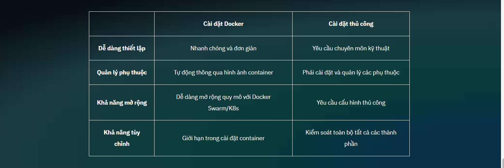

# Getting Started with OpenCTI - Tổng quan về các thành phần chính 
## 1. Tổng quan về các thành phần chính - Key Components Overview

OpenCTI là một nền tảng được thiết kế để quản lý thông tin tình báo về mối đe dọa mạng.

```
Tuyên bố miễn trừ trách nhiệm: Bài học này là tùy chọn cho người dùng OpenCTI đã sẵn sàng bắt đầu vận hành nền tảng để sử dụng. Bài học này chủ yếu dành cho những người tham gia triển khai và thiết lập nền tảng. Tuy nhiên, sẽ rất có lợi nếu hiểu được cấu trúc của nền tảng và tham gia cuộc trò chuyện vì hứng thú!
```

Cho dù bạn tò mò về cách OpenCTI hoạt động hay bạn là quản trị viên hệ thống, DevOps hoặc bất kỳ chuyên gia nào đang chuẩn bị triển khai, việc hiểu các thành phần chính của nó và cách chúng tương tác là rất quan trọng để triển khai thành công. Bài học này đóng vai trò là 101 cho người triển khai, đồng thời giới thiệu cho tất cả các cá nhân về cấu trúc cơ bản của OpenCTI và hướng dẫn bạn cách xây dựng và sử dụng nó hiệu quả trong các hoạt động hàng ngày.

### Các thành phần chính của OpenCTI
Khi bắt đầu với OpenCTI, bạn có thể tò mò về các thành phần cốt lõi tạo nên nền tảng. Mặc dù không phải tất cả người dùng đều cần hiểu toàn bộ kiến ​​trúc đằng sau OpenCTI, nhưng việc nắm bắt cơ bản các yếu tố chính này có thể nâng cao trải nghiệm và hiểu biết của bạn về nền tảng:
+ Data Connectors
+ RabbitMQ
+ Workers
+ Elasticsearch
+ Redis
+ User Interface

```
Điều quan trọng cần lưu ý là khi chúng ta đi sâu vào các thành phần chính này, nền tảng OpenCTI được xây dựng bằng cách sử dụng STIX 2.1 Standard: Một khuôn khổ chuẩn hóa để thể hiện thông tin tình báo về mối đe dọa có cấu trúc, cho phép OpenCTI nhập, xuất và chia sẻ dữ liệu về mối đe dọa theo định dạng nhất quán và có thể tương tác. Nếu bạn muốn tìm hiểu sâu hơn, bạn có thể điều hướng đến Operationalizing STIX 2.1 with OpenCTI: The Fundamentals(mở trong một tab mới)khóa học để hiểu sâu sắc về OpenCTI và Tiêu chuẩn STIX 2.1.
```


<video controls src="Getting Started 101.mp4" title="Title"></video>

Sự thật thú vị:


```
Thực sự có một loài chim 'loài kết nối'. Đó là loài chim biển kết nối hệ sinh thái đất liền và biển. Giống như cách loài chim kết nối của chúng ta thu hẹp khoảng cách giữa thế giới thông tin và hệ sinh thái trí tuệ có cấu trúc của OpenCTI (theo nghĩa bóng)
```

Flip Cards lật từng thẻ trong hoạt động Lật thẻ bên dưới để xem lại mô tả ngắn gọn về các thành phần chính của OpenCTI.

#### Data Connectors
Data Connectors: kết nối dữ liệu nhập và xuất dữ liệu thô và dữ liệu tình báo về mối đe dọa

#### RabbitMQ 
RabbitMQ: Đảm bảo luồng dữ liệu thông suốt bằng cách quản lý hàng đợi tin nhắn giữa các quy trình, ngăn ngừa tình trạng quá tải hệ thống.

#### Workers
Workers: Quản lý xử lý nền

#### Elasticsearch
Elasticsearch: Lưu trữ và truy vấn dữ liệu

#### Redis
Redis: Xử lý bộ nhớ đệm, một kỹ thuật được sử dụng để lưu trữ dữ liệu thường xuyên truy cập ở một vị trí lưu trữ tạm thời (bộ nhớ đệm)

#### User Interface (UI)
User Interface (UI): Lớp trực quan và tương tác cho phép người dùng điều hướng, quản lý và phân tích dữ liệu tình báo mối đe dọa một cách hiệu quả.

## Bắt đầu với OpenCTI

Khi cài đặt OpenCTI bằng Docker, các dịch vụ bắt buộc (như Elasticsearch, Redis, RabbitMQ, v.v.) được cấu hình sẵn trong tệp Docker Compose của kho lưu trữ GitHub OpenCTI. Điều này có nghĩa là bạn không cần phải cấu hình thủ công các dịch vụ này vì chúng sẽ được thiết lập tự động khi bạn triển khai các vùng chứa Docker. Chỉ cần tải xuống tệp [Docker](https://github.com/OpenCTI-Platform/opencti/blob/master/opencti-platform/opencti-dev/docker-compose.yml) Docker Compose (docker-compose.yml)(mở trong một tab mới), cấu hình các biến môi trường và làm theo hướng dẫn để mọi thứ chạy.

Tuy nhiên, bạn có tùy chọn triển khai OpenCTI theo cách thủ công. Khi triển khai OpenCTI theo cách thủ công, hãy đảm bảo rằng các thành phần thiết yếu như Elasticsearch , Redis và RabbitMQ được cấu hình đúng cách. Nếu bạn đang sử dụng kho lưu trữ GitHub được cấu hình sẵn với Docker Compose, các thành phần này đã được bao gồm, nhưng nếu triển khai từ đầu, bạn sẽ cần tự thiết lập chúng. Luôn xác minh cài đặt chính xác của chúng trước khi tiếp tục.

Nếu bạn hoặc nhóm quản trị hệ thống/DevOps của bạn chưa triển khai và cấu hình nền tảng OpenCTI, thì bây giờ là lúc để thực hiện. Sau đây là tổng quan nhanh về các bước:

Cài đặt Docker (nếu sử dụng Docker)

Cài đặt Portainer để quản lý các container Docker

Sao chép kho lưu trữ OpenCTI và cấu hình môi trường

Thiết lập Elasticsearch, RabbitMQ, Redis và các dịch vụ cần thiết khác

Triển khai bằng Docker Compose hoặc thiết lập thủ công

Cấu hình các biến môi trường và khởi động dịch vụ

Để biết hướng dẫn triển khai và cấu hình chi tiết, hãy tham khảo Tài liệu chính thức của OpenCTI [Link doc](https://docs.opencti.io/latest/deployment/installation/#configure-the-environment)

### Docker vs. Manual

`Docker (Khuyến nghị)`: Được khuyến nghị cho hầu hết các trường hợp, đặc biệt là sản xuất, vì nó đơn giản hóa việc quản lý triển khai.

Điều kiện tiên quyết:

+ Cài đặt Docker và Docker Compose .

+ Đối với Linux: sudo apt install docker-compose

+ Đối với Windows/Mac: Tải xuống Docker Desktop.

Lợi ích của Docker

+ Đơn giản hóa việc quản lý sự phụ thuộc bằng cách đóng gói mọi thứ thành các dịch vụ được chứa trong container.
+ Dễ dàng mở rộng quy mô sản xuất với các công cụ điều phối như Kubernetes.
+ Được khuyến nghị cho hầu hết người dùng, đặc biệt là trong môi trường đám mây

`Thủ công`: Chỉ được khuyến nghị nếu bạn có yêu cầu cụ thể hoặc muốn kiểm soát hoàn toàn quá trình thiết lập.

Điều kiện tiên quyết:

+ Yêu cầu Node.js, Python và các phụ thuộc bổ sung. Đảm bảo các phiên bản tương thích.

Lợi ích của việc cài đặt thủ công
+ Cung cấp khả năng kiểm soát hoàn toàn môi trường và các yếu tố phụ thuộc.
+ Hữu ích cho người dùng hoặc tổ chức có yêu cầu bảo mật nghiêm ngặt.



### Hướng dẫn cài đặt OpenCTI :

Cung cấp hướng dẫn từng bước để cài đặt OpenCTI trên nhiều nền tảng khác nhau, đảm bảo quá trình thiết lập diễn ra suôn sẻ. [Link hướng dẫn](https://docs.opencti.io/latest/deployment/installation/)

### Kho lưu trữ Github
[Link github dự án](https://github.com/OpenCTI-Platform)

Kho lưu trữ GitHub chính thức cho Nền tảng OpenCTI . Kho lưu trữ này chứa mã nguồn cho dự án OpenCTI, bao gồm:

+ Cơ sở mã nền tảng OpenCTI chính
+ Tài liệu hướng dẫn cách đóng góp
+ Cấu hình ví dụ và hình ảnh Docker
+ Các vấn đề và thảo luận xung quanh phát triển nền tảng

## 2. Thu thập, tổng hợp và chia sẻ dữ liệu - Ingestion, Aggregation, and Data Sharing

Việc đưa dữ liệu vào và ra khỏi OpenCTI bằng STIX 2.1 cho phép tích hợp liền mạch, xử lý hiệu quả và chia sẻ thông tin tình báo về mối đe dọa một cách an toàn.

Trong bài học này, bạn sẽ khám phá các khía cạnh chính của việc thu thập, tổng hợp và chia sẻ dữ liệu trong OpenCTI. Bạn sẽ hiểu được cách OpenCTI tương tác với các công cụ bên ngoài, tạo điều kiện cho các quy trình làm việc cộng tác và chia sẻ dữ liệu qua nhiều phương pháp khác nhau.

OpenCTI là một nền tảng mạnh mẽ để quản lý và chia sẻ thông tin tình báo về mối đe dọa. Nó hoạt động liền mạch với khuôn khổ STIX 2.1 để tập trung, làm giàu và phân phối dữ liệu.

Sau đây là cách mọi thứ kết hợp với nhau:
### Ingestion 
Ingestion: Thu thập là quá trình nhập dữ liệu tình báo về mối đe dọa từ nhiều nguồn khác nhau vào OpenCTI.

Những điểm chính:

+ Nguồn: Nguồn cấp dữ liệu về mối đe dọa, nhật ký nội bộ, cơ sở dữ liệu bên ngoài, nền tảng tình báo của bên thứ ba.
+ Mục đích: Tập trung tất cả dữ liệu về mối đe dọa có liên quan để phân tích và so sánh toàn diện.
+ Danh sách các đầu nối có sẵn có thể tìm thấy tại đây. [Link](https://filigran.notion.site/OpenCTI-Ecosystem-868329e9fb734fca89692b2ed6087e76#c94bf651e08146c4855a25efeaabc574)

Ví dụ:
Nhập các chỉ số định dạng STIX 2.1 từ nhà cung cấp thông tin tình báo mối đe dọa bên ngoài vào OpenCTI.


### Aggregation 
Aggregation: Tổng hợp trong OpenCTI bao gồm việc tinh chỉnh dữ liệu được thu thập để đảm bảo dữ liệu được cấu trúc, làm giàu và có thể thực hiện được trong nền tảng.

Các khía cạnh chính:
+ Chuẩn hóa : Chuẩn hóa định dạng để đảm bảo tính nhất quán trên tất cả các nguồn dữ liệu.
+ Làm giàu : Thêm ngữ cảnh, liên kết dữ liệu với thông tin tình báo có liên quan.

Ví dụ:
Một tập hợp đa dạng các chỉ số đe dọa được chuyển đổi sang định dạng STIX 2.1 và kết nối với các thực thể liên quan, cải thiện khả năng sử dụng và phân tích dữ liệu.


### Data Sharing
Data Sharing: Chia sẻ dữ liệu là việc phân phối dữ liệu tình báo về mối đe dọa đã được xử lý và làm giàu giữa các hệ thống, tổ chức hoặc bên liên quan khác nhau.

Những điểm chính:
+ Phương pháp: Xuất STIX Bundle, sử dụng API của OpenCTI, tận dụng các trình kết nối, truyền tệp an toàn.
+ Bảo mật: Đảm bảo tính bảo mật và toàn vẹn thông qua mã hóa và các giao thức như Giao thức đèn giao thông (TLP) để chỉ ra ranh giới chia sẻ.

Ví dụ:
+ Xuất các gói STIX: Chia sẻ các báo cáo toàn diện về mối đe dọa với các đối tác hoặc ISAC.
+ API OpenCTI: Tự động chia sẻ dữ liệu và tích hợp với các công cụ bảo mật khác.
+ Bộ kết nối: Đồng bộ hóa dữ liệu liền mạch với các nền tảng bên ngoài như MISP hoặc AlienVault OTX.
+ Chuyển giao an toàn: Sử dụng kênh được mã hóa để chia sẻ thủ công khi cần thiết.


### Ingestion Methods - Phương pháp tiêu thụ
#### TAXII Feeds - Nguồn cấp dữ liệu TAXII 

`Mô tả` : TAXII là một giao thức chuẩn hóa để cung cấp thông tin tình báo về mối đe dọa theo định dạng STIX.

`Trường hợp sử dụng` : Tự động hóa việc thu thập dữ liệu về mối đe dọa có cấu trúc từ các nguồn bên ngoài đáng tin cậy (ví dụ: ISAC, cơ quan chính phủ).

`Điểm mạnh` : Được chuẩn hóa, tự động hóa và được sử dụng rộng rãi để chia sẻ thông tin tình báo về mối đe dọa.

Để hiểu cách sử dụng Bộ sưu tập TAXII OpenCTI trong nền tảng của bạn, vui lòng đọc Tài liệu Cách nhập Bộ sưu tập TAXII từ xa [Link](https://docs.opencti.io/latest/usage/import-automated/#taxii-feeds)

#### Connector Feeds - Nguồn cấp dữ liệu kết nối
`Mô tả : `Nhiều nhà cung cấp thông tin tình báo về mối đe dọa cung cấp API để cung cấp nguồn cấp dữ liệu về mối đe dọa theo các định dạng như JSON hoặc định dạng độc quyền, thường được gọi là Nguồn cấp dữ liệu về mối đe dọa.

`Trường hợp sử dụng :` Liên tục thu thập dữ liệu từ các dịch vụ tình báo mối đe dọa của bên thứ ba hoặc các hệ thống nội bộ với các bản cập nhật thường xuyên.

`Điểm mạnh :` Linh hoạt và cho phép thu thập dữ liệu theo thời gian thực hoặc theo lịch trình.

`Nhà cung cấp ví dụ :` Recorded Future, VirusTotal, AbuseIPDB.

Để được hướng dẫn về cách triển khai trình kết nối cho môi trường OpenCTI của bạn, vui lòng đọc Tài liệu về trình kết nối. [Link](https://docs.opencti.io/latest/usage/import-automated/#connectors)

#### File-Based Feeds - Nguồn cấp dữ liệu dựa trên tệp
`Mô tả : ` Nguồn cấp dữ liệu về mối đe dọa được cung cấp dưới dạng tệp có thể tải xuống (ví dụ: tệp CSV, JSON, STIX) từ các cổng thông tin an toàn.

`Trường hợp sử dụng :` Thu thập hàng loạt các tập dữ liệu lớn có thể không có sẵn thông qua API hoặc nguồn cấp dữ liệu TAXII.

`Điểm mạnh :` Lý tưởng cho việc nhập dữ liệu ban đầu trên quy mô lớn hoặc chia sẻ thông tin tình báo về mối đe dọa ngoại tuyến.

`Ví dụ :` Danh sách IOC hàng loạt được chia sẻ bởi các đối tác trong ngành hoặc nhóm nội bộ

#### SIEM/Log Connectors - SIEM/Kết nối nhật ký
`Mô tả : `Các đầu nối kéo nhật ký hoặc dữ liệu về mối đe dọa từ SIEM (ví dụ: Splunk, QRadar) hoặc hệ thống quản lý nhật ký.

`Trường hợp sử dụng : `Liên kết nguồn cấp dữ liệu mối đe dọa bên ngoài với dữ liệu nhật ký nội bộ để làm giàu và xác thực IOC.

`Điểm mạnh :` Cho phép tích hợp thông tin tình báo về mối đe dọa bên ngoài với dữ liệu đo từ xa bên trong để phân tích thời gian thực.

#### Proprietary Threat Platforms - Nền tảng đe dọa độc quyền
`Mô tả :` Một số nhà cung cấp cung cấp nền tảng hoặc trình kết nối độc quyền của riêng họ để cung cấp thông tin tình báo về mối đe dọa trực tiếp vào OpenCTI.

`Trường hợp sử dụng :` Tích hợp liền mạch với hệ sinh thái thông tin tình báo về mối đe dọa độc quyền của nhà cung cấp.

`Điểm mạnh :` Tích hợp trực tiếp với thiết lập và bảo trì tối thiểu.

`Nhà cung cấp ví dụ :` Recorded Future, Mandiant, CrowdStrike Intelligence.

#### Manual Entry - Nhập thủ công
`Mô tả :` Nhập thủ công dữ liệu tình báo mối đe dọa vào OpenCTI thông qua UI hoặc bằng cách tải tệp lên.

`Trường hợp sử dụng :` Xử lý các báo cáo về mối đe dọa đột xuất hoặc một lần cần được xem xét và thêm thủ công.

`Điểm mạnh :` Cung cấp tính linh hoạt cho dữ liệu mối đe dọa tùy chỉnh hoặc duy nhất không có sẵn thông qua nguồn cấp dữ liệu tự động.


## External Tools - Công cụ bên ngoài 
Mặc dù tích hợp với các công cụ bên ngoài được coi là phương pháp thu thập, nhưng cần lưu ý rằng OpenCTI cũng cho phép bạn xuất dữ liệu sang các công cụ này. Luồng hai chiều này đảm bảo rằng OpenCTI không chỉ là một công cụ thụ động để lưu trữ và quản lý thông tin tình báo mà còn là một bên tham gia tích cực vào hệ sinh thái chia sẻ thông tin tình báo về mối đe dọa lớn hơn.


#### SIEM - Security Information and Event Management 
Quản lý sự kiện và thông tin bảo mật

SIEM (ví dụ: Splunk):
+ Mục đích: Phát hiện và cảnh báo về hoạt động đáng ngờ.
+ Tích hợp: Nhập cảnh báo (ví dụ: IP được gắn cờ) vào OpenCTI để làm giàu thông tin.

`Ví dụ:` Một Nhà phân tích SOC điều tra một miền đáng ngờ được Splunk đánh dấu.

#### SOAR - Security Orchestration, Automation, and Response
Điều phối bảo mật, tự động hóa và phản hồi

Công cụ SOAR (ví dụ: Cortex XSOAR):
+ Mục đích: Tự động hóa các phản hồi như chặn IP.
+ Tích hợp: Sử dụng dữ liệu phong phú từ OpenCTI để kích hoạt sổ tay hướng dẫn tự động.

`Ví dụ:` Tự động làm giàu các cảnh báo SIEM/EDR đáng ngờ bằng các IOC được báo cáo trong OpenCTI.

####   EDR - Endpoint Detection and Response
Phát hiện và phản hồi điểm cuối

EDR (ví dụ: Crowdstrike, SentinelOne)
+ Mục đích: Phát hiện và ứng phó với các mối đe dọa điểm cuối.

Tích hợp:
+ OpenCTI có thể đẩy các chỉ số tới hệ thống EDR để chủ động chặn và giám sát các tệp, IP và tên miền độc hại.
+ Nhóm SOC có thể xem xét các cảnh báo từ nền tảng EDR và ​​tiếp tục cập nhật OpenCTI để có vòng phản hồi.

`Ví dụ:` Crowdstrike Falcon nhận được chỉ số từ OpenCTI với thông tin được làm giàu để cải thiện độ chính xác khi phát hiện điểm cuối và phản hồi.

#### Firewall & Proxies 
Tường lửa & Proxy

Tường lửa và Proxy (ví dụ: sử dụng công cụ SOAR để tự động hóa quy trình tường lửa):
+ Mục đích: Chặn lưu lượng truy cập độc hại và cô lập các mối đe dọa.
+ Tích hợp: Cập nhật danh sách chặn bằng Chỉ báo OpenCTI.

`Ví dụ:` OpenCTI có thể tích hợp với các nhà cung cấp tường lửa và proxy như Zscaler để tăng cường thông tin tình báo về mối đe dọa và tự động thực thi chính sách dựa trên các chỉ số thời gian thực."

## Tổng hợp
Trong OpenCTI, tổng hợp dữ liệu kết hợp dữ liệu thô (như nguồn cấp dữ liệu đe dọa, hệ thống nội bộ và nguồn cấp dữ liệu TAXII) với thông tin ngữ cảnh được làm giàu (như thông tin tình báo về mối đe dọa), đảm bảo rằng thông tin này có thể hành động và sử dụng được cho mục đích phòng thủ chiến lược. Mặc dù nguồn cấp dữ liệu đe dọa và thông tin tình báo về mối đe dọa có liên quan về mặt khái niệm, nhưng chúng là những điểm khác biệt chính thường bị nhầm lẫn với nhau.

Hãy cùng khám phá sự khác biệt giữa hai yếu tố chính của tổng hợp:

### Threat Intelligence (Tình báo về mối đe dọa)  vs Threat Feeds (Nguồn cấp dữ liệu đe dọa)
Tương tự nhưng không giống hệt nhau

Nguồn cấp dữ liệu về mối đe dọa cung cấp dữ liệu thô cần thiết để phát hiện hoạt động độc hại, trong khi thông tin tình báo về mối đe dọa làm phong phú và ngữ cảnh hóa dữ liệu này để cung cấp thông tin cho các biện pháp phòng thủ chiến lược và cải thiện việc ra quyết định.

Trong OpenCTI, ví dụ:
+ `Threat Feeds - Nguồn cấp dữ liệu về mối đe dọa` hoạt động như đầu vào, cung cấp các dữ liệu quan sát được và IOC.
+ `Threat Intelligenc - Tình báo về mối đe dọa` làm giàu dữ liệu thô này bằng cách liên kết nó với các chiến dịch, tác nhân và TTP để tạo ra thông tin chi tiết có thể hành động được. 


Điểm mấu chốt là tổng hợp trong OpenCTI liên quan đến việc tập trung nhiều loại dữ liệu khác nhau, chẳng hạn như nguồn cấp dữ liệu về mối đe dọa và thông tin tình báo về mối đe dọa, thành một nền tảng gắn kết. Quá trình này rất cần thiết vì nó chuyển đổi dữ liệu thô, phân tán thành thông tin có cấu trúc, được làm giàu có thể dễ dàng phân tích và chia sẻ. Bằng cách hợp nhất các nguồn dữ liệu đa dạng, OpenCTI cho phép các nhóm bảo mật đưa ra quyết định sáng suốt dựa trên những hiểu biết toàn diện, có thể hành động.

### Data Sharing and Collaboration - Chia sẻ dữ liệu và cộng tác
Tăng cường sự cộng tác thông qua việc chia sẻ dữ liệu trong OpenCTI

Tổng hợp dữ liệu tập trung thông tin, cho phép chia sẻ phong phú và quy trình làm việc cộng tác để có cái nhìn toàn diện về bối cảnh mối đe dọa. Cộng tác hiệu quả là cốt lõi của các biện pháp thực hành tốt nhất về an ninh mạng. Có thể tập trung dữ liệu với  các phương pháp thu thập dữ liệu sau đó có thể cho phép làm giàu để có được bức tranh toàn cảnh về bối cảnh mối đe dọa sẽ tăng cường chia sẻ dữ liệu , trao quyền cho bạn và nhóm của bạn cùng nhau bảo vệ chống lại các mối đe dọa mạng đang phát triển. Hãy cùng khám phá các khái niệm này với sự nhấn mạnh đặc biệt vào sự cộng tác.

#### INTERNAL 
Chia sẻ dữ liệu nội bộ bao gồm việc phổ biến thông tin tình báo về mối đe dọa được làm giàu trong tổ chức, cho phép các nhóm khác nhau (SOC, Phản ứng sự cố, Thông tin tình báo về mối đe dọa) hành động dựa trên dữ liệu.

`Mục đích :`
Thúc đẩy sự cộng tác giữa các nhóm nội bộ để phát hiện mối đe dọa, ứng phó sự cố và phòng thủ chủ động hiệu quả.

`Các yếu tố chính :`
+ `Báo cáo được chia sẻ` :
  + Báo cáo trong OpenCTI đóng vai trò như một bộ chứa các thực thể liên quan (Chỉ số, Đối tượng quan sát, Tác nhân đe dọa) và các mối quan hệ, cung cấp góc nhìn toàn diện về mối đe dọa.

+ `Dấu hiệu TLP :`
  + Sử dụng dấu hiệu Giao thức đèn giao thông (TLP)  để chỉ ra nhóm nào có thể truy cập và sử dụng thông tin tình báo về mối đe dọa cụ thể.

+ `Phân công công việc :`
  + Phân công báo cáo hoặc chỉ số cụ thể cho các thành viên trong nhóm (ví dụ: Nhà phân tích SOC hoặc Người ứng phó sự cố) trong nền tảng OpenCTI.

`Ví dụ về quy trình làm việc :`

+ a. Chuyên gia phân tích tình báo mối đe dọa sẽ tạo báo cáo về chiến dịch lừa đảo và bao gồm các chỉ số liên quan (IP độc hại, địa chỉ email và tên miền).
+ b. Báo cáo được đánh dấu là TLP:AMBER , hạn chế quyền truy cập chỉ dành cho các nhóm nội bộ.
+ c. Báo cáo được giao cho Nhà phân tích SOC để quản lý các chỉ số xâm phạm (IOC).
+ d. Nhà phân tích SOC cập nhật các quy tắc tường lửa và SIEM của tổ chức dựa trên các chỉ số và màn hình giám sát hoạt động liên quan.

Khi bạn tiến bộ qua Filigran Academy, bạn sẽ thấy những khái niệm chính này trong hành động, được áp dụng vào các tình huống thực tế và quy trình làm việc hợp tác giữa các nhóm. Hãy tận hưởng trải nghiệm học tập và nắm bắt nhiều con đường mà nó cung cấp khi bạn phát triển các kỹ năng và kiến ​​thức của mình!

## 3. Các bước tiếp theo và tài nguyên - Next Steps and Resources
Bây giờ bạn có thể xem lại các Bước tiếp theo và Tài nguyên trước khi thoát khỏi khóa học.

`Triển khai & Thiết lập OpenCTI`: Thực hiện theo các bước được cung cấp trong tài liệu Triển khai và Thiết lập OpenCTI. [Link](https://docs.opencti.io/latest/deployment/overview/)

`Tham gia cộng đồng Slack!:` Hãy kết nối với Cộng đồng Slack của chúng tôi, nơi bạn sẽ nhận được hỗ trợ và cập nhật liên tục. Tương tác với đồng nghiệp và truy cập các nguồn tài nguyên có giá trị để nâng cao trải nghiệm học tập của bạn. [Link](https://filigran-community.slack.com/join/shared_invite/zt-2w4kinajb-LbYS0NoaO_7lqGaLpfPlYA#/shared-invite/email)

`Các bước tiếp theo:` Bạn nên bắt đầu hành trình học tập của mình với cấp độ 101. Nhưng hãy thoải mái chuyển hướng. Nút này sẽ chuyển hướng bạn đến danh mục OpenCTI 101. Lộ trình học tập Fundamentals of Threat Intelligence là một khởi đầu tuyệt vời. [Link](https://academy.filigran.io/page/opencti-101)


