## Preparation
Installing the Required Software

Each year millions of home routers are sold to consumers; a large majority of them don't even know what's running on them. Today we're going to take a look. Before proceeding, we will need a few tools:
+ Access to a Linux distribution (Or WSL) with strings and binwalk on it.
+ Linksys WRT1900ACS v2 Firmware found here: https://github.com/Sq00ky/Dumping-Router-Firmware-Image/
+ Lastly, ensure binwalk has JFFS2 support with the following command:
```
sudo pip install cstruct; 
git clone https://github.com/sviehb/jefferson;
cd jefferson && sudo python setup.py install
```
After you've got the tools, you're ready to set up your workspace!

Rebuilding the Firmware

First, we're going to clone the repository that holds the firmware:

`git clone https://github.com/Sq00ky/Dumping-Router-Firmware-Image/ /opt/Dumping-Router-Firmware && cd /opt/Dumping-Router-Firmware/`

Next, we're going to unzip the multipart zip file:

`7z x ./FW_WRT1900ACSV2_2.0.3.201002_prod.zip`

running ls you should see the firmware image:

`FW_WRT1900ACSV2_2.0.3.201002_prod.img`

 Lastly, running a sha256sum  on the firmware image you should be left with the value `dbbc9e8673149e79b7fd39482ea95db78bdb585c3fa3613e4f84ca0abcea68a4`

 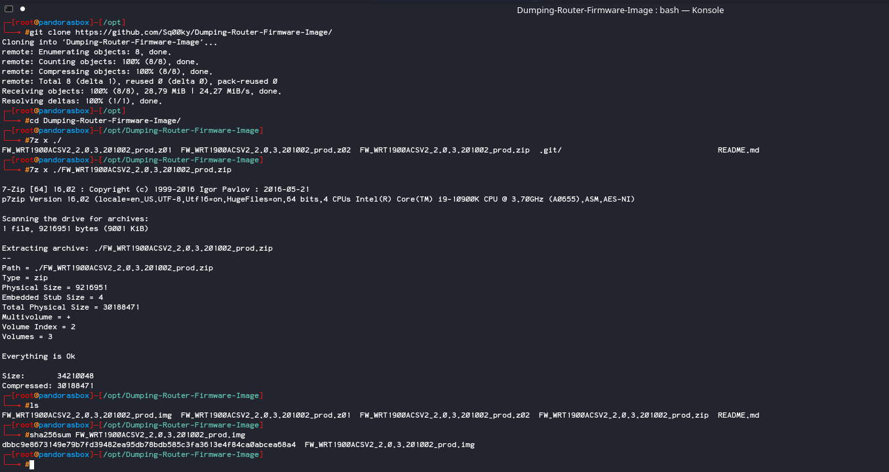

 ## Investigating Firmware
 One Inch Deep Analysis

In this section we will be taking a look at the firmware, checking for strings and, dump the file system from the image. The next section will cover mounting and exploring the file system.

Answer the questions below

While running strings on the file, there is a lot of notable clear text. This is due to certain aspects of the firmware image not being encrypted. This likely means that with Binwalk, we can dump the firmware from the image.

### What does the first clear text line say when running strings on the file?
`Linksys WRT1900ACS Router`

Dùng strings để đọc file `strings FW_WRT1900ACSV2_2.0.3.201002_prod.img`

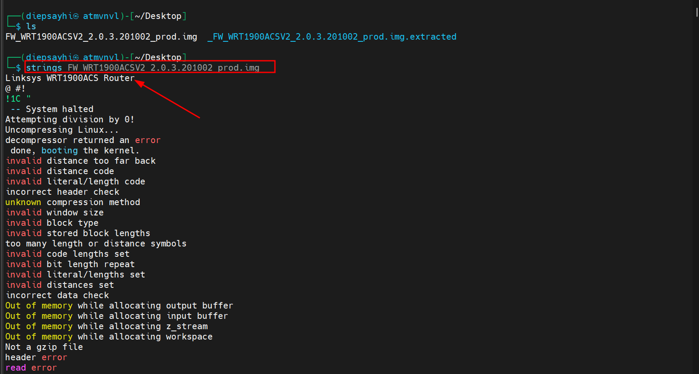

### Also, using strings, what operating system is the device running?
`Linux`

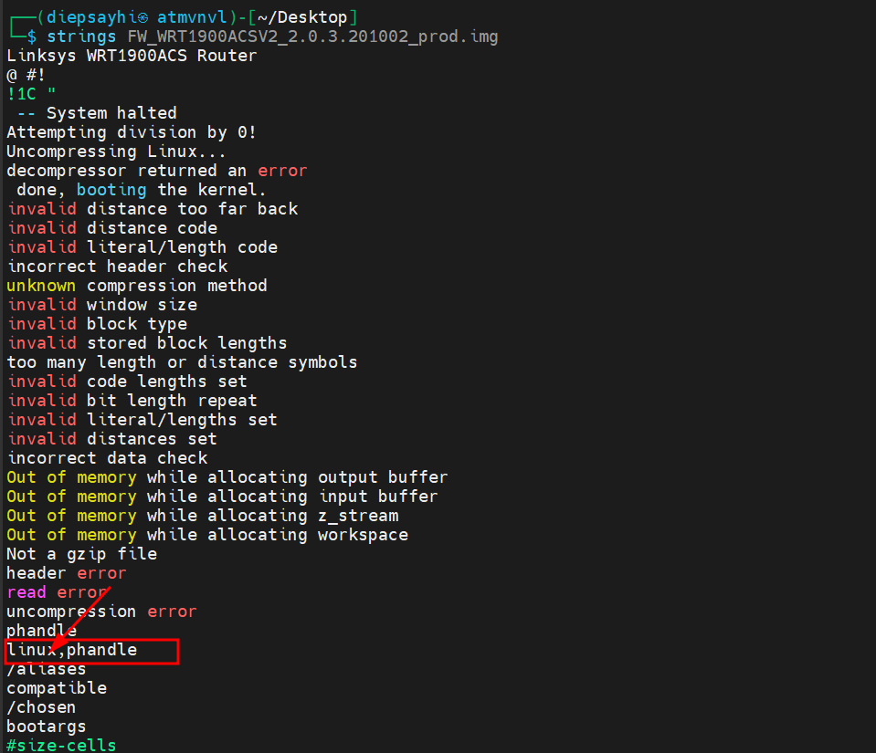

### What option within Binwalk will allow us to extract files from the firmware image?
`-e`

Dùng OS AttifyOS v3.0 với lệnh `binwalk -e FW_WRT1900ACSV2_2.0.3.201002_prod.img`

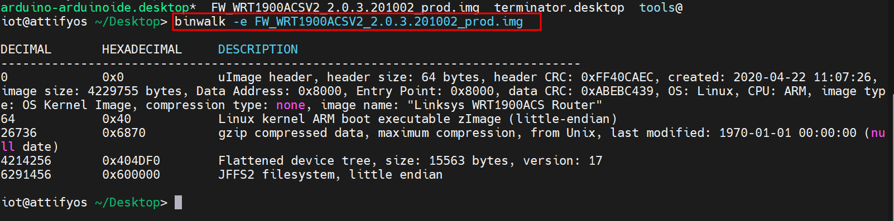


### Now that we know how to extract the contents of the firmware image, what was the first item extracted?
`uImage header`

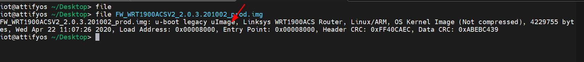

### What was the creation date?
`2020–04–22 11:07:26`

Dùng lệnh file kiểm tra 

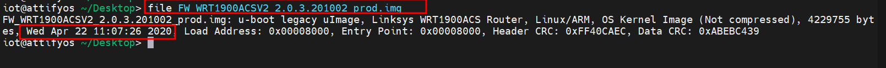

### What is the CRC of the image?
`0xABEBC439`

Dựa vào kết quả trên 

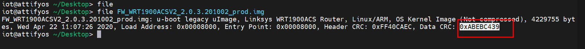

### What is the image size?
`4229755 bytes`

Tương tự

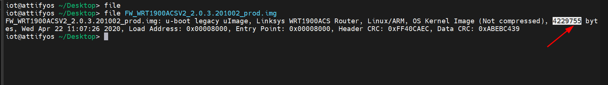

### What architecture does the device run?
`ARM`

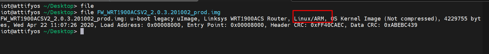

### Running strings on 6870, we notice a large chunk of clear text. We can actually rerun binwalk on this file to receive even more files to investigate. Interestingly enough, a copy of the Linux kernel is included. What version is it for?
`3.10.39`

Dùng lệnh `binwalk -e 6870`

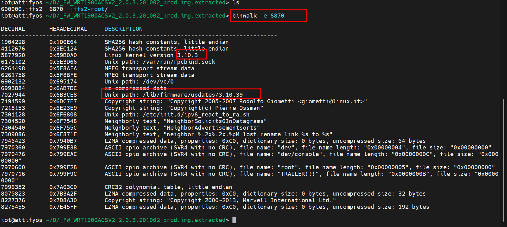

## Mounting and Analysis of the Router's Filesystem
Mounting the Filesystem

In this section, we will begin to review how to mount the file system. Note, if you are doing this with any other file system, not in the Little Endian format, you must convert it from Big Endian to Little 
Endian using a tool called jffs2dump. But here is a reasonably concise guide to mounting the filesystem:

`Step 1.` If /dev/mtdblock0 exists, remove the file/directory and re-create the block device

```
rm -rf /dev/mtdblock0
mknod /dev/mtdblock0 b 31 0
```

`Step 2.` Create a location for the jffs2 filesysystem to live
```
mkdir /mnt/jffs2_file/
```

`Step 3`. Load required kernel modules
```
modprobe jffs2
modprobe mtdram
modprobe mtdblock
```
`Step 4.` Write image to /dev/mtdblock0
```
dd if=/home/iot/Desktop/_FW_WRT1900ACSV2_2.0.3.201002_prod.img.extracted/600000.jffs2 of=/dev/mtdblock0
```
`Step 5.` Mount file system to folder location
```
mount -t jffs2 /dev/mtdblock0 /mnt/jffs2_file/
```
`Step 6.` Lastly, move into the mounted filesystem.
```
cd /mnt/jffs2_file/
```

To explain a little bit of what the command does, we're creating a block device (mtdblock (Memory Technology Device)) that will allow us to dump the flash memory. We're first removing it if it exists, and then re-creating it.

Next, we're creating a location for our jffs2 file to be mounted to.

After that, we're loading some kernel modules that will allow us to interact with the jffs2 file system and dump the flash memory.

Next, we write the file system to the block device, and after that we mount the mtdblock device which now contains the flash memory of the file system. 

Lastly, executing  cd /mnt/jffs2_file/ we are now sitting inside the router's dumped firmware and can begin the investigation.

### Where does linuxrc link to?
`/bin/busybox`

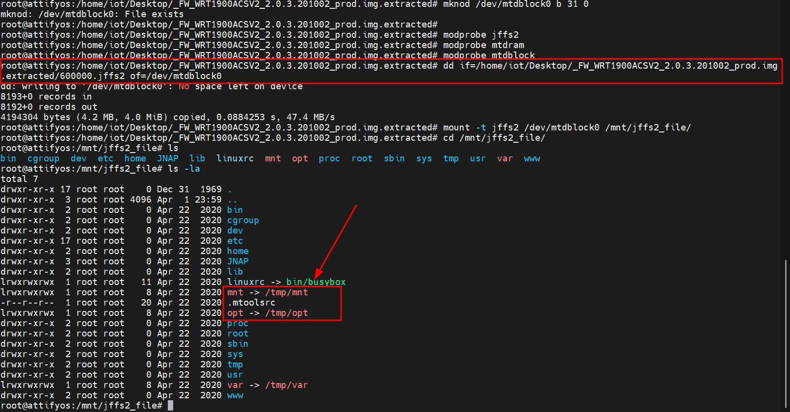

### What parent folder do mnt, opt, and var link to?
`/tmp/`


### What folder would store the router's HTTP server?
`/www/`


### Why is that? Well, busybox is more or less a tool suite of common executable commands within the Unix environment.
`busybox`

Khá nhiều công cụ liên lết đến busybox

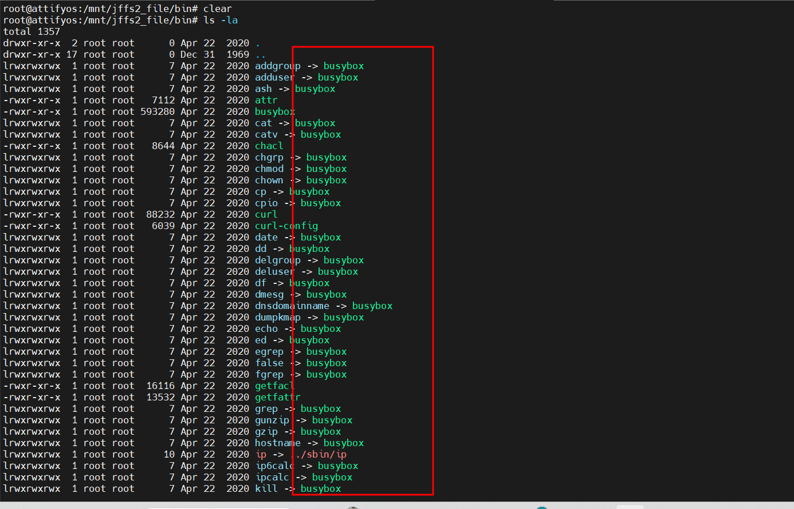

### Interestingly, what database would be running within the bin folder if the router was online?
`sqlite3`

Ta thấy `sqlite3` làm cơ sở dữ liệu duy nhất 

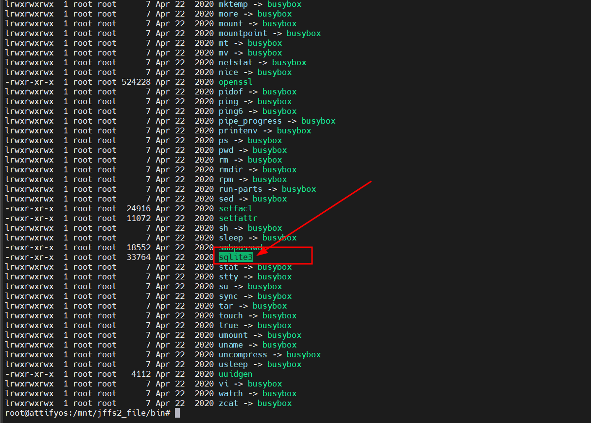

### The following notable folder of interest is /etc/. This folder contains many configuration files for the router, such as Access Point power levels regulated by certain countries. One you might recognize is the FCC (Federal Communications Commission). We can even see the build date of the device. What is the build date? 
`2020-04-22 11:44`

Dùng `cat builddate`

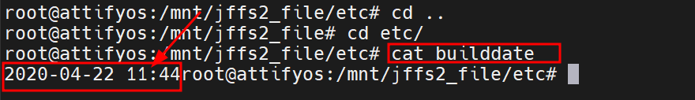

### There are even files related to the SSH server on the device. What SSH server does the machine run?
`dropbear`
Dựa vào lệnh ls ta có thấy máy chủ dùng khóa RSA 

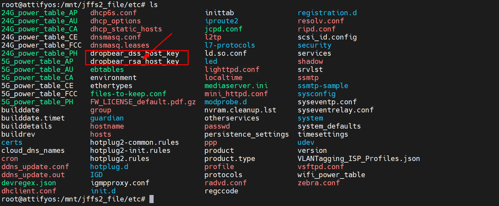

### We can even see the file for the media server, which company developed it? This company use to own Linksys at one point in time, which is likely why it is still being used.
`Cisco`

Tượng tự 

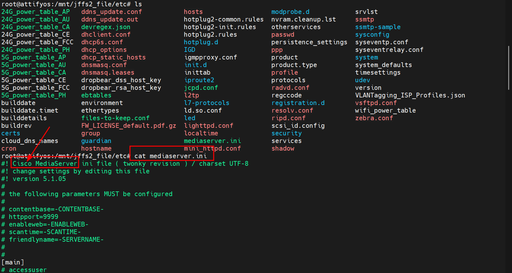

### Which file within /etc/ contains a list of standard Network services and their associated port numbers?
`services`

Tương tự 

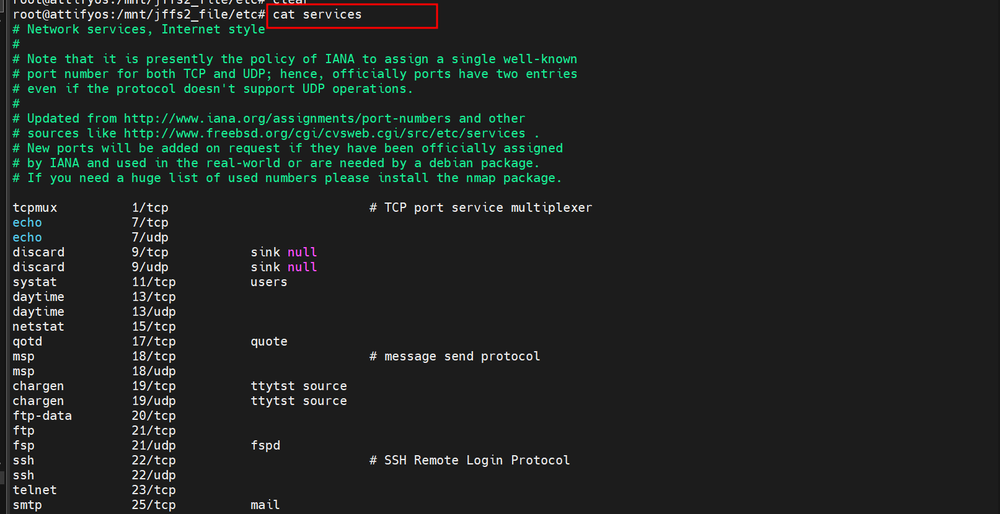

### Which file contains the default system settings?
`system_defaults`

Tương tự

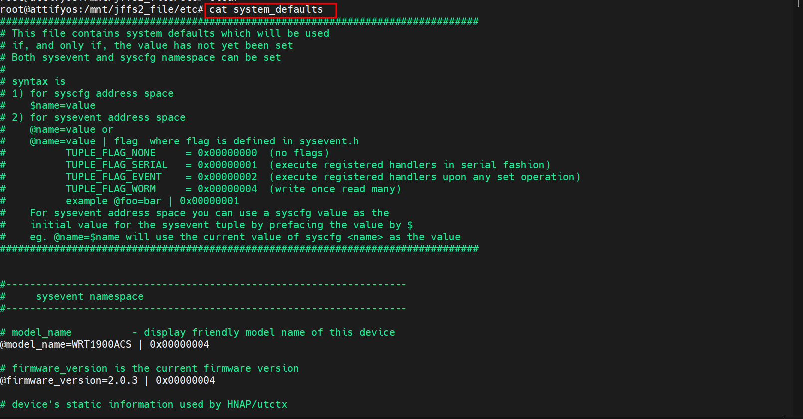

### What is the specific firmware version within the /etc/ folder?
`2.0.3.201002`

Tương tự 


